### 11.8.3　高级定时器

最强大的定时器接口，毫无疑问来自于POSIX的时钟函数。

POSIX中基于时钟的定时器，建立实例、初始化以及最终删除定时器函数分别使用三个函数：timer_create()建立定时器，timer_settime()初始化定时器，timer_delete()则销毁它。

> POSIX的定时器接口毫无疑问是最先进的，但也是最新的（因而可移植性最差），同时是最不易使用的。如果优先考虑简洁或者可移植性，那么setitimer()是更好的选择。

#### 创建定时器

使用timer_create()可以创建定时器：

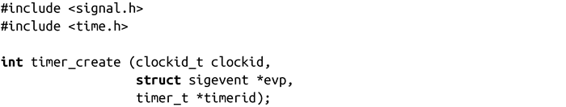
调用timer_create()成功时，会创建一个与POSIX时钟clockid相关联的新定时器，在timerid中存储一个唯一的定时器标记，并返回0。该调用很少会设置定时器运行的条件，就像在下一节将要看到的那样，在启动定时器之前什么都不会发生。

下面的例子在POSIX时钟CLOCK_PROCESS_CPUTIME_ID上创建了一个新的定时器，并将定时器ID保存到timer中：

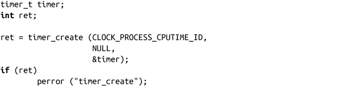
失败时，调用会返回-1，timerid则未定义，调用会设置errno为下列值之一：

EAGAIN

系统缺少足够的资源来完成请求。

EINVAL

clockid指定的POSIX时钟是非法的。

ENOTSUP

clockid指定的POSIX时钟合法，但是系统不支持使用该时钟作为定时器。POSIX保证所有实现均支持CLOCK_REALTIME时钟作为定时器。其他的时钟是否支持依赖于不同的实现。

evp参数（当值非NULL时）会定义当定时器到期时的异步通知。头文件<signal.h>定义了该结构体。它的内容对程序员来说是不可见的，但至少包含以下字段：

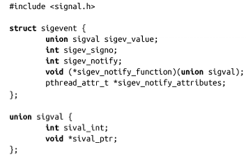
在基于时钟的POSIX定时器到期时，在内核如何通知进程的问题上有更多的控制能力，它允许进程指定内核将发送的信号，甚至让内核产生一个新线程在定时器到期时完成一定的功能。进程在定时器过期时的行为通过sigev_notify来指定，必须是以下三个值之一：

SIGEV_NONE

“空”通知，当定时器到期时，什么都不发生。

SIGEV_SIGNAL

当定时器到期时，内核给进程发送一个由sigev_signo指定的信号。在信号处理程序中，si_value被设置为sigev_value。

SIGEV_THREAD

当定时器过期时，内核产生一个新线程（在该进程内），并让其执行sigev_notify_function，将sigev_value作为它唯一的参数。该线程在这个函数返回时终止。如果sigev_notify_attributes不是NULL，pthread_attr_t结构体则定义了新线程的行为。

就像之前的例子中看到的，如果evp是NULL，定时器的到期通知将做如下设置：sigev_notify为SIGEV_SIGNAL，sigev_signo为SIGALRM，sigev_value 为定时器的ID。就是说，缺省情况下这些定时器以POSIX计时器的方式进行通知。然而通过自定义方式，可以做更多的工作！

下面的例子建立了一个基于CLOCK_REALTIME的定时器。当定时器到期时，内核发出SIGUSR1信号，并把si_value设置成保存定时器ID的地址值：

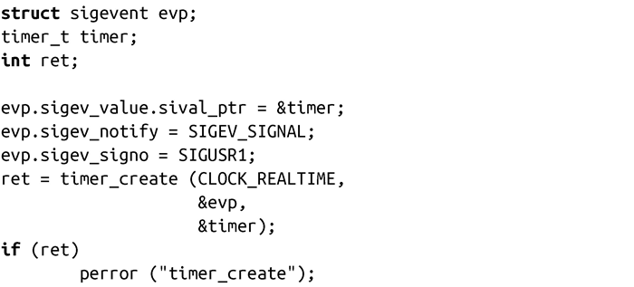
#### 设置定时器

由timer_create()建立的定时器是未设置的。可以使用timer_settime()将其与一个过期时间关联并开始计时：

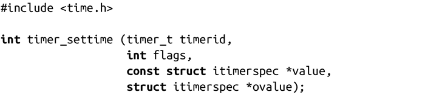
成功调用timer_settime()将设置timerid指定的定时器的过期时间为value，value为一个timerspec结构体：

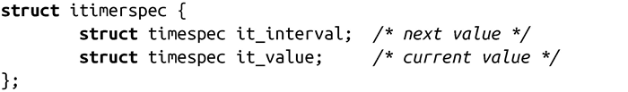
像setitimer()一样，it_value指定了当前定时器过期时间。当定时器过期时，将用it_interval的值更新it_value。如果it_interval是0，定时器就不是计时器，并在it_value 过期后停止运行。

回顾一下之前提到的内容，timespec结构体可以提供纳秒级精度：

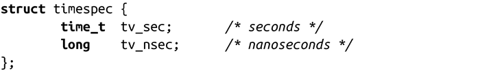
如果flags是TIMER_ABSTIME，value指定的时间则为绝对时间（和相对于当前时间值的默认解释相反）。这个修正的操作可以避免在获取当前时间、计算相对的时间差值、确定未来时间点，以及设置定时器时产生竞争条件。详情可以参见先前一节“高级的睡眠方法”。

如果ovalue不是NULL，之前定时器的过期时间将存储在itimerspec中。如果定时器之前未被设置，结构体的成员将全部设置为0。

使用timer值来初始化之前用timer_create()初始化的定时器，下面的代码创建了个每秒都过期的周期定时器：

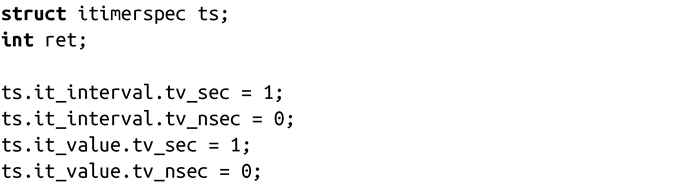

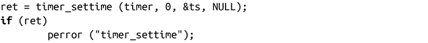
#### 获取定时器的过期时间

你可以在任何时刻使用timer_gettime()获取一个定时器的过期时间（expiration）而不必重新设置它：

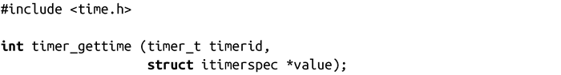
成功调用timer_gettime()将timerid指定的定时器过期时间存储到value指向的结构体中，并返回0。失败时，调用返回-1，并设置errno为下列值之一：

EFAULT

value不是合法指针。

EINVAL

timerid不是合法定时器。

看个例子：

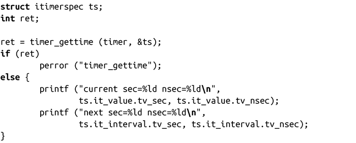
#### 获取定时器的超时值

POSIX定义了个接口来确定给定定时器目前的超时值：

成功时，timer_getoverrun()返回在定时器过期与实际定时器过期后通知（例如通过信号）进程间的多余时长。比方说，在我们先前的例子中，一个1毫秒的定时器运行了10毫秒，调用就会返回9。

如果超时值大于等于DELAYTIMER_MAX，调用就返回DELAYTIMER_MAX。

失败时，该函数返回-1，并设置errno值为EINVAL，这个唯一的错误表明由timerid指定的定时器不合法。

看下面这个例子：

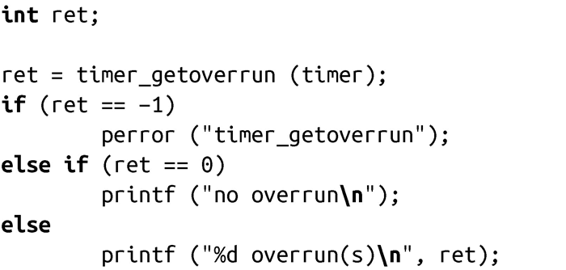
#### 删除定时器

删除定时器很简单：

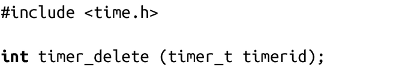
成功调用timer_delete()时，将销毁由timerid指定的定时器，并返回0。失败时，调用返回-1，并设置errno为EINVAL，这个唯一的错误表明timerid不是合法的定时器。

<a class="my_markdown" href="['#ac111']">[1]</a> 译注：Wall Time或Wall Clock Time，有时也称运行时间，译者感觉墙钟时间这一表达更准确生动。

<a class="my_markdown" href="['#ac112']">[2]</a> Linux内核现在已经支持“tickles”操作，因此这个说法不太严谨。

<a class="my_markdown" href="['#ac113']">[3]</a> Hz现在是内核编译期的可选项，在x86架构上值可以是100、250和1 000。虽然如此，用户空间的应用代码还是不应该依赖于任何特定的Hz值。

