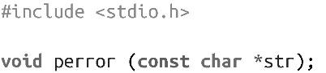
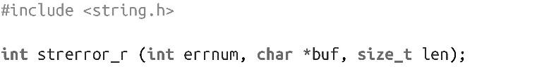
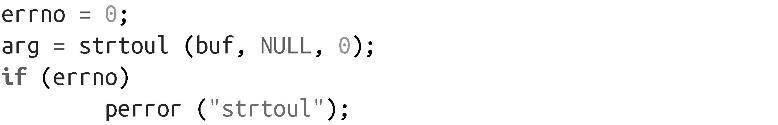
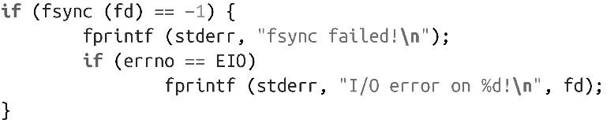
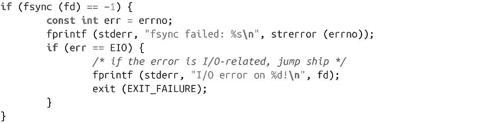

### 1.4.8　错误处理

毋庸置疑，检测错误和处理错误都是极其重要的。在系统编程中，错误是通过函数的返回值和特殊变量errno描述。glibc为库函数和系统调用提供透明errno支持。本书中给出的绝大多数接口都使用这种机制来报告错误。

函数通过特殊返回值（通常是-1，具体值取决于函数）通知调用函数发生了错误。错误值告诉调用函数发生了错误，但是并没有给出错误发生的原因。变量errno用于定位错误的原因。

变量errno在<errno.h>中定义如下：

errno的值只有当errno设置函数显示错误后（通常返回-1）才生效，而在程序的后续执行过程中都可以修改其值。

可以直接读写errno变量，它是可修改的左值。errno的值和特定错误的文本描述一一对应。预处理器#define也和数值errno值一一对应。举个例子，预处理器定义EACCES等于1，表示“权限不足”。表1-2给出了标准定义和相应的错误描述列表。

<b class="my_markdown">表1-2　错误代码及其描述</b>

| 处理器预定义 | 描述 |
| :-----  | :-----  | :-----  | :-----  |
| E2BIG | 参数列表太长 |
| EACCES | 权限不足 |
| EAGAIN | 重试 |
| EBADF | 文件号错误 |
| EBUSY | 设备或资源忙 |
| ECHILD | 无子进程 |
| EDOM | 数学参数不在函数域内 |
| EEXIST | 文件已存在 |
| EFAULT | 地址错误 |
| EFBIG | 文件太大 |
| EINTR | 系统调用被中断 |
| EINVAL | 参数无效 |
| EIO | I/O错误 |
| EISDIR | 是目录 |
| EMFILE | 打开文件太多 |
| EMLINK | 太多链接 |
| ENFILE | 文件表溢出 |
| ENODEV | 无此设备 |
| ENOENT | 无此文件或目录 |
| ENOEXEC | 执行格式错误 |
| ENOMEM | 内存用尽 |
| ENOSPC | 设备无剩余空间 |
| ENOTDIR | 非目录 |
| ENOTTY | 不合理I/O控制操作 |
| ENXIO | 无此设备或地址 |
| EPERM | 操作不允许 |
| EPIPE | 管道损坏 |
| ERANGE | 结果范围太大 |
| EROFS | 只读文件系统 |
| ESPIPE | 非法定位 |
| ESRCH | 无此进程 |
| ETXTBSY | 文本文件忙 |
| EXDEV | 跨文件系统链接 |

C库提供了很多函数，可以把errno值转换成对应的文本。只有错误报告以及类似的操作时才需要。检测错误和处理错误可以直接通过预处理器定义和errno进行处理。

第一个这样的函数是perror():

该函数向stderr（标准错误输出）打印以str指向的字符串为前缀，紧跟着一个冒号，然后是由errno表示的当前错误的字符串。为了使输出的错误信息有用，执行失败的函数名称应该包含在字符串中。例如：

C库还提供了strerror()和strerror_r()函数，原型如下：

和

前一个函数返回由errnum描述的错误的字符串指针。字符串可能不会被应用程序修改，但是会被后续的perror()和strerror()函数调用修改。因此，strerror函数不是线程安全的。

相反，strerror_r()函数是线程安全的。它向buf指向的长度为len的缓冲区中写入数据。strerror_r()函数在成功时返回1，失败时返回-1。有意思的是，这个函数在错误时也设置errno。

对于某些函数，在返回类型范围内返回的值都是合法的。在这些情况下，在调用前，errno必须设置成0，且调用后还会检查（这些函数保证在真正错误时返回非0的errno值）。例如：

检查errno时常犯的一个错误是忘记任何库函数或系统调用都可能修改它。举个例子，以下代码是有bug的：

在跨函数调用时，如果需要保留errno值，就需要保存该值：

如本节前面所介绍的，在单线程程序中，errno是个全局变量。然而，在多线程程序中，每个线程都有自己的errno，因此它是线程安全的。

