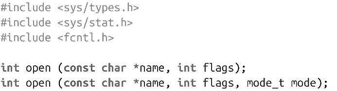
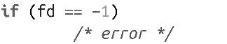
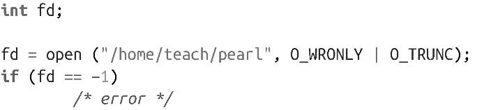

### 2.1.1　系统调用open()

通过系统调用open()，可以打开文件并获取其文件描述符：

如果系统调用open()执行成功，会返回文件描述符，指向路径名name所指定的文件。文件位置即文件的起始位置（0），文件打开方式是根据参数flags值来确定的。

#### open()的flags参数

flags参数是由一个或多个标志位的按位或组合。它支持三种访问模式：O_RDONLY、O_WRONLY或O_RDWR，这三种模式分别表示以只读、只写或读写模式打开文件。

举个例子，以下代码以只读模式打开文件/home/kidd/madagascar：

不能对以只读模式打开的文件执行写操作，反之亦然。进程必须有足够的权限才能调用系统调用来打开文件。举个例子，假设用户对某个文件只有只读权限，该用户的进程只能以O_RDONLY模式打开文件，而不能以O_WRONLY或O_RDWR模式打开。

flags参数还可以和下面列出的这些值进行按位或运算，修改打开文件的行为：

O_APPEND

文件将以追加模式打开。也就是说，在每次写操作之前，将会更新文件位置指针，指向文件末尾。即使有另一个进程也在向该文件写数据，以追加模式打开的进程在最后一次写操作时，还是会更新文件位置指针，指向文件末尾（参见2.3.2小节）。

O_ASYNC

当指定的文件可读或可写时，会生成一个信号（默认是SIGIO）。O_ASYNC标志位只适用于FIFO、管道、socket和终端，不适用于普通文件。

O_CLOEXEC

在打开的文件上设置“执行时关闭”标志位。在执行新的进程时，文件会自动关闭。设置O_CLOEXEC标志位可以省去调用fcntl()来设置标志位，且避免出现竞争。Linux内核2.6.23以上的版本才提供该标志位。

O_CREAT

当参数name指定的文件不存在时，内核自动创建。如果文件已存在，除非指定了标志位O_EXCL，否则该标志位无效。

O_DIRECT

打开文件用于直接I/O（参见2.5节）。

O_DIRECTORY

如果参数name不是目录，open()调用会失败。该标志位被置位时，内部会调用opendir()。

O_EXCL

当和标志位O_CREAT一起使用时，如果参数name指定的文件已经存在，会导致open()调用失败。用于防止创建文件时出现竞争。如何没有和标志位O_CREAT一起使用，该标志位就没有任何含义。

O_LARGEFILE

文件偏移使用64位整数表示，可以支持大于2GB的文件。64位操作系统中打开文件时，默认使用该参数。

O_NOATIME+

在读文件时，不会更新该文件的最后访问时间。该标志位适用于备份、索引以及类似的读取系统上所有文件的程序，它可以避免为了更新每个文件的索引节点而导致的大量写操作。Linux内核2.6.8以上的版本才提供该标志位。

O_NOCTTY

如果给定的参数name指向终端设备（比如/dev/tty），它不会成为这个进程的控制终端，即使该进程当前没有控制终端。该标志位很少使用。

O_NOFOLLOW

如果参数name指向一个符号链接，open()调用会失败。正常情况下，指定该标志位会解析链接并打开目标文件。如果给定路径的子目录也是链接，open()调用还是会成功。举个例子，假设name值为/etc/ship/plank.txt，如果plank.txt是个符号链接， open()会失败；然而，如果etc或ship是符号链接，只要plank.txt不是符号链接，调用就会成功。

O_NONBLOCK

文件以非阻塞模式打开。不管是open()调用还是其他操作，都不会导致进程在I/O中阻塞（sleep）。这种情况只适用于FIFO。

O_SYNC

打开文件用于同步I/O。在数据从物理上写到磁盘之前，写操作都不会完成；普通的读操作已经是同步的，因此该标志位对读操作无效。POSIX还另外定义了两个标志位O_DSYNC和O_RSYNC，在Linux系统中，这些标志位和O_SYNC含义相同（参见2.4.3节）。

O_TRUNC

如果文件存在，且是普通文件，并且有写权限，该标志位会把文件长度截断为0。对于FIFO或终端设备，该标志位无效，对于其他文件类型，其行为是未定义。因为对文件执行截断操作，需要有写权限，所以如果文件是只读，指定标志位O_TRUNC，行为也是未定义的。

举个例子，以下代码会打开文件/home/teach/pearl，用于写操作。如果文件已经存在，该文件长度会被截断为0；由于没有指定标志位O_CREAT，如果文件不存在，该open调用会失败：

