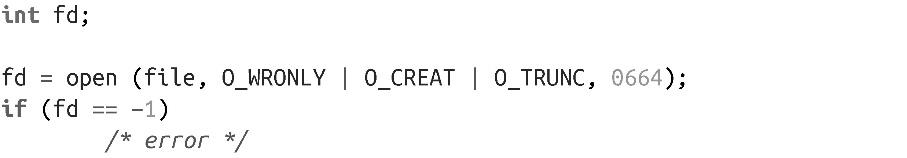

### 2.1.3　新建文件的权限

前面给出的两种open()系统调用方式都是合法的。除非创建了新文件，否则会忽略参数mode；如果给定O_CREAT参数，则需要该参数。在使用O_CREAT参数时如果没有提供参数mode，结果是未定义的，而且通常会很糟糕——所以千万不要忘记！

当创建文件时，参数mode提供了新建文件的权限。对于新建的文件，打开文件时不会检查权限，因此可以执行与权限相反的操作，比如以只读模式打开文件，却在打开后执行写操作。

参数mode是常见的UNIX权限位集合，比如八进制数0644（文件所有者可以读写，其他人只能读）。从技术层面看，POSIX是根据具体实现确定值，支持不同的UNIX系统设置自己想要的权限位。但是，每个UNIX系统对权限位的实现都采用了相同的方式。因此，虽然技术上不可移植，但在任何系统上指定0644或0700效果都是一样的。

为了弥补mode中比特位的不可移植性，POSIX引入了一组可以按位操作的常数，按位结果提供给参数mode：

S_IRWXU

文件所有者有读、写和执行的权限。

S_IRUSR

文件所有者有读权限。

S_IWUSR

文件所有者有写权限。

S_IXUSR

文件所有者有执行权限。

S_IRWXG

组用户有读、写和执行权限。

S_IRGRP

组用户有读权限。

S_IWGRP

组用户有写权限。

S_IXGRP

组用户有执行权限。

S_IRWXO

任何人都有读、写和执行的权限。

S_IROTH

任何人都有读权限。

S_IWOTH

任何人都有写权限。

S_IXOTH

任何人都有执行权限。

实际上，最终写入磁盘的权限位是由mode参数和用户的文件创建掩码（umask）执行按位与操作而得到。umask是进程级属性，通常是由login shell设置，通过调用umask()来修改，支持用户修改新创建的文件和目录的权限。在系统调用open()中，umask位要和参数mode取反。因此，umask 022和mode参数0666取反后，结果是0644。对于系统程序员，在设置权限时通常不需要考虑umask——umask是为了支持用户限制程序对于新建文件的权限设置。

举个例子，以下代码会对文件file执行写操作。如果文件不存在，假定umask值为022，文件在创建时指定权限为0644（虽然参数mode值为0664）。如果文件已存在，其长度会被截断为0：

为了代码可读性（以可移植性为代价，至少理论上如此），这段代码可以改写成如下，其效果完全相同：

