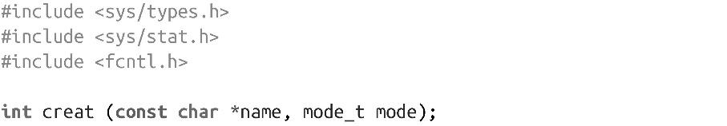
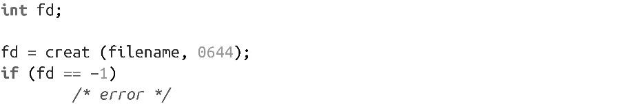
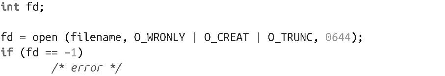
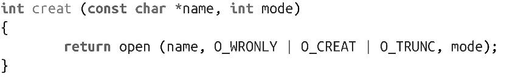

### 2.1.4　creat()函数

OWRONLY | O_CREAT | O****TRUNC 的组合经常被使用，因而专门有个系统调用提供这个功能：

> 诚如你所看到的，函数名creat的确少了个e。UNIX之父Ken Thompson曾开玩笑说他在UNIX设计中感到最遗憾的就是漏掉了这个字母。

典型的creat()调用如下：

这段代码等效于：

在绝大多数Linux架构<a class="my_markdown" href="['#anchor23']">[3]</a>中，creat()是个系统调用，虽然在用户空间也很容易实现：

这是一个历史遗留问题，因为之前open()函数只有两个参数，所以也设计了creat()函数。当前，为了向后兼容，仍然保留creat()这个系统调用。在新的体系结构中，creat()可以实现成调用open()的库函数调用，如上所示。

