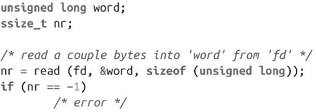

### 2.2　通过read()读文件

前面讨论了如何打开文件，现在一起来看如何读文件。在接下来的一节中，我们将讨论写操作。

最基础、最常见的读取文件机制是调用read()，该系统调用在POSIX.1中定义如下：

每次调用read()函数，会从fd指向的文件的当前偏移开始读取len字节到buf所指向的内存中。执行成功时，返回写入buf中的字节数；出错时，返回-1，并设置errno值。fd的文件位置指针会向前移动，移动的长度由读取到的字节数决定。如果fd所指向的对象不支持seek操作（比如字符设备文件），则读操作总是从“当前”位置开始。

基本用法很简单。下面这个例子就是从文件描述符fd所指向的文件中读取数据并保存到word中。读取的字节数即unsigned long类型的大小，在Linux的32位系统上是4字节，在64位系统上是8字节。成功时，返回读取的字节数；出错时，返回-1：

这个简单的实现存在两个问题：可能还没有读取len字节，调用就返回了，而且可能产生某些可操作的错误，但这段代码没有检查和处理。不幸的是，类似这样的代码非常普遍。我们一起看看如何改进它。

