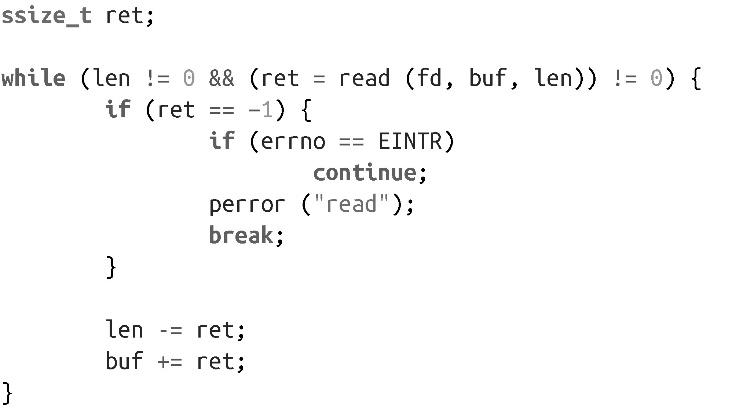

### 2.2.2　读入所有字节

诚如前面所描述的，由于调用read()会有很多不同情况，如果希望处理所有错误并且真正每次读入len个字节（至少读到EOF），那么之前简单“粗暴”的read()调用并不合理。要实现这一点，需要有个循环和一些条件语句，如下：

这段代码判断处理了五种情况。循环从fd所指向的当前文件位置读入len个字节到buf中，一直读完所有len个字节或者EOF为止。如果读入的字节数大于0但小于len，就从len中减去已读字节数，buf增加相应的字节数，并重新调用read()。如果调用返回-1，并且errno值为EINTR，会重新调用且不更新参数。如果调用返回-1，并且errno设置为其他值，会调用perror()，向标准错误打印一条描述，循环结束。

读取数据采用部分读入的方式不但可行，而且还很常见。但是，由于很多开发人员没有正确检查处理这种很短的读入请求，带来了无数bug。请不要成为其中一员！

