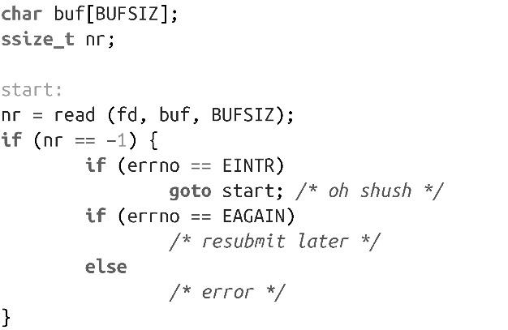

### 2.2.3　非阻塞读

有时，开发人员不希望read()调用在没有数据可读时阻塞在那里。相反地，他们希望调用立即返回，表示没有数据可读。这种方式称为非阻塞I/O，它支持应用以非阻塞模式执行I/O操作，因而如果是读取多个文件，以防错过其他文件中的可用数据。

因此，需要额外检查errno值是否为EAGAIN。正如前面所讨论的，如果文件描述符以非阻塞模式打开（即open()调用中指定参数为O_NONBLOCK，参见2.1.1节中的“open()调用的参数”），并且没有数据可读，read()调用会返回-1，并设置errno值为EAGAIN，而不是阻塞模式。当以非阻塞模式读文件时，必须检查EAGAIN，否则可能因为丢失数据导致严重错误。你可能会用到如下代码：

> 处理EAGAIN的情况和处理EINTR的方式不同（用了goto start）。也许你并不需要采用非阻塞I/O。非阻塞I/O的意义在于捕捉EAGAIN的情况，并执行其他逻辑。

