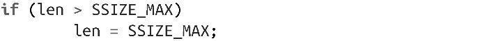

### 2.2.5　read()调用的大小限制

类型size_t和ssize_t是由POSIX确定的。类型size_t保存字节大小，类型ssize_t是有符号的size_t（负值用于表示错误）。在32位系统上，对应的C类型通常是unsigned int和int。因为这两种类型常常一起使用，ssize_t的范围更小，往往限制了size_t的范围。

size_t的最大值是SIZE_MAX，ssize_t的最大值是SSIZE_MAX。如果len值大于SSIZE_MAX，read()调用的结果是未定义的。在大多数Linux系统上，SSIZE_MAX的值是LONG_MAX，在32位系统上这个值是2 147 483 647。这个数值对于一次读操作而言已经很大了，但还是需要留心它。如果使用之前的读循环作为通用的读方式，可能需要给它增加以下代码：

调用read()时如果len参数为0，会立即返回，且返回值为0。

