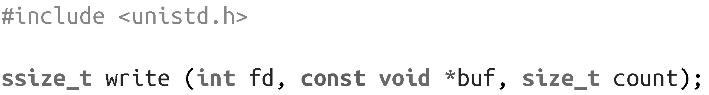
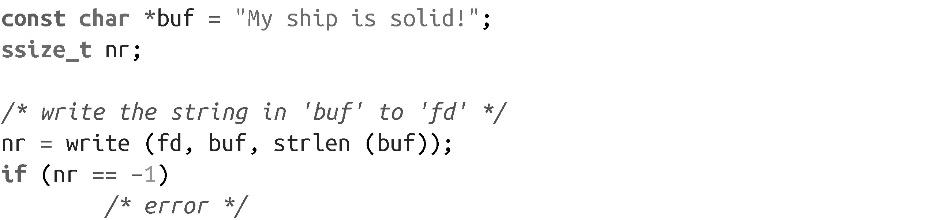
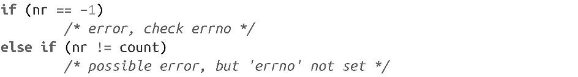

### 2.3　调用write()写

写文件，最基础最常见的系统调用是write()。和read()一样，write()也是在POSIX.1中定义的：

write()调用会从文件描述符fd指向的文件的当前位置开始，将buf中至多count个字节写入到文件中。不支持seek的文件（如字符设备）总是从起始位置开始写。

write()执行成功时，会返回写入的字节数，并更新文件位置。出错时，返回-1，并设置errno值。调用write()会返回0，但是这种返回值没有任何特殊含义，它只是表示写入了零个字节。

和read()一样，write()调用的最基本用法也很简单：

还是和read()一样，以上这种用法不太正确。调用方还需要检查各种“部分写（partial write）”的场景：

