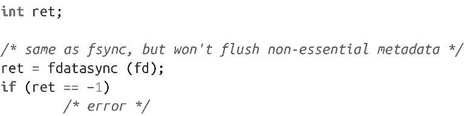
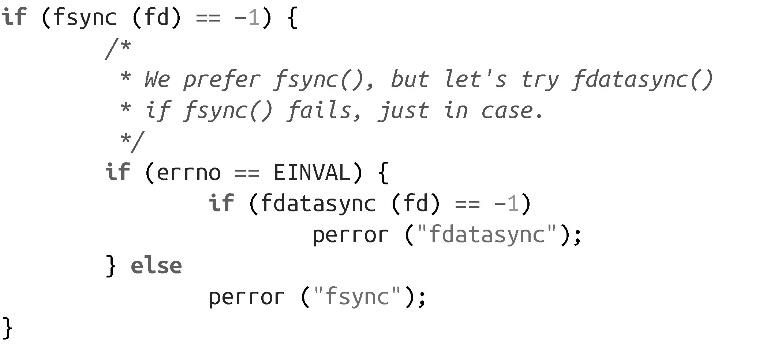

### 2.4.1　fsync()和fdatasync()

为了确保数据写入磁盘，最简单的方式是使用系统调用fsync()，在POSIX.1b标准中定义如下：

系统调用fsync()可以确保和文件描述符fd所指向的文件相关的所有脏数据都会回写到磁盘上。文件描述符fd必须以写方式打开。该调用会回写数据和元数据，如创建的时间戳以及索引节点中的其他属性。该调用在硬件驱动器确认数据和元数据已经全部写到磁盘之前不会返回。

对于包含写缓存的硬盘，fsync()无法知道数据是否已经真正在物理磁盘上了。硬盘会报告说数据已经写完了，但是实际上数据还在硬盘驱动器的写缓存上。好在，在硬盘驱动器缓存中的数据会很快写入到磁盘上。

Linux还提供了系统调用fdatasync()：

fdatasync()的功能和fsync()类似，其区别在于fdatasync()只会写入数据以及以后要访问文件所需要的元数据。例如，调用fdatasync()会写文件的大小，因为以后要读该文件需要文件大小这个属性。fdatasync()不保证非基础的元数据也写到磁盘上，因此一般而言，它执行更快。对于大多数使用场景，除了最基本的事务外，不会考虑元数据如文件修改时间戳，因此fdatasync()就能够满足需求，而且执行更快。

> fsync()通常会涉及至少两个I/O操作：一是回写修改的数据，二是更新索引节点的修改时间戳。因为索引节点和文件数据在磁盘上可能不是紧挨着——因而会带来代价很高的seek操作——在很多场景下，关注正确的事务顺序，但不包括那些对于以后访问文件无关紧要的元数据（比如修改时间戳），使用fdatasync()是提高性能的简单方式。

fsync()和fdatasync()这两个函数用法一样，都很简单，如下：

而fdatasync()的使用方式如下：

这两个函数都不保证任何已经更新的包含该文件的目录项会同步到磁盘上。这意味着如果文件链接最近刚更新，文件数据可能会成功写入磁盘，但是却没有更新到相关的目录中，导致文件不可用。为了保证对目录项的更新也都同步到磁盘上，必须对文件目录也调用fsync()进行同步。

#### 返回值和错误码

成功时，两个调用都返回0。失败时，都返回-1，并设置errno值为以下三个值之一：

EBADF

给定文件描述符不是以写方式打开的合法描述符。

EINVAL

给定文件描述符所指向的对象不支持同步。

EIO

在同步时底层I/O出现错误。这表示真正的I/O错误，经常在发生错误处被捕获。

对于某些Linux版本，调用fsync()可能会失败，因为文件系统没有实现fsync()，即使实现了fdatasync()。某些“固执”的应用可能会在fsync()返回EINVAL时尝试使用fdatasync()。代码如下：

在POSIX标准中，fsync()是必要的，而fdatasync()是可选的，因此在所有常见的Linux文件系统上，都应该为普通文件实现fsync()系统调用。但是，特殊的文件类型（比如那些不需要同步元数据的）或不常见的文件系统可能只实现了fdatasync()系统调用。

