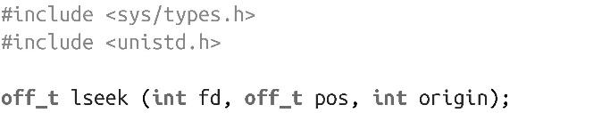
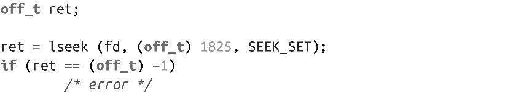
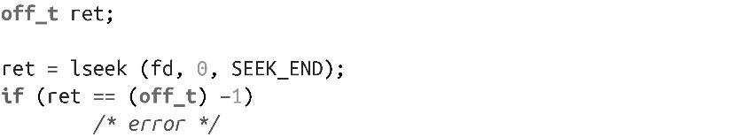

### 2.7　用lseek()查找

一般情况下，I/O是线性的，由于读写引发的隐式文件位置更新都需要seek操作。但是，某些应用要跳跃式读取文件，需要随机访问而不是线性访问。lseek()系统调用能够将文件描述符的位置指针设置成指定值。lseek()只更新文件位置，没有执行其他操作，也并不初始化任何I/O：

lseek()调用的行为依赖于origin参数，该参数可以是以下任意值之一：

SEEK_CUR

将文件位置设置成当前值再加上pos个偏移值，pos可以是负值、0或正值。如果pos值为0，返回当前文件位置值。

SEEK_END

将文件位置设置成文件长度再加上pos个偏移值，pos可以是负值、0或正值。如果pos值为0，就设置成文件末尾。

SEEK_SET

将文件位置设置成pos值。如果pos值为0，就设置成文件开始。

调用成功时返回新的文件位置，错误时返回-1，并相应设置errno值。

举个例子，以下代码把fd的文件位置指针设置为1825：

下面是把fd的文件位置设置成文件末尾：

由于lseek()返回更新后的文件位置，可以通过SEEK_CUR，把偏移pos设置成0，确定当前文件位置：

到目前为止，lseek()调用最常见的用法是将指针定位到文件的开始、末尾或确定文件描述符的当前文件位置。

