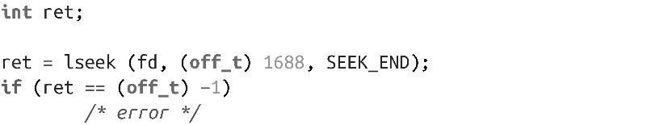

### 2.7.1　在文件末尾后查找

lseek()支持在文件末尾之后进行查找。例如，以下代码会定位到fd指向文件末尾之后的1688字节。

对这种用法本身而言，查找到文件末尾之后没什么意义——对该新的文件位置的读请求会返回EOF。但是，如果在该位置有个写请求，在文件的旧长度和新长度之间的空间会用0来填充。

这种零填充区间称为“空洞（hole）”。在UNIX系文件系统上，空洞不占用任何物理磁盘空间。这意味着文件系统上所有文件的大小加起来可以超过磁盘的物理大小。包含空洞的文件称为“稀疏文件（sparse file）”。稀疏文件可以节省很多空间，并提升性能，因为操作空洞不会产生任何物理I/O。

对文件空洞部分的读请求会返回相应的二进制0。

