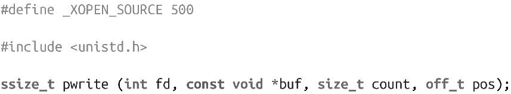

### 2.8　定位读写

Linux提供了两种read()和write()系统调用的变体来替代lseek()，每次读写操作时，都把文件位置作为参数，在完成时，不会更新文件位置。

read()的变体是pread()：

该调用会从文件描述符fd的pos位置开始读取，共读取count个字节到buf中。

write()的变体是pwrite()：

该调用从文件描述符fd的pos位置开始，从buf中写count字节到文件中。

这两个调用和read()、write()调用的最主要区别在于它们完全忽略了当前文件位置；相反，pread()和pwrite()调用用的是参数pos值。此外，当调用完成时，它们不会更新文件位置指针。换句话说，任何read()和write()交替调用可能会破坏定位读写的结果。

定位读写只适用于可查找的文件描述符，包括普通文件。pread()和pwrite()调用的语义相当于在read()或write()调用之前执行lseek()调用，但仍然存在以下三点区别。

1．pread()和pwrite()调用更易于使用，尤其是对于一些复杂的操作，比如在文件中反向或随机查找定位。

2．pread()和pwrite()调用在结束时不会修改文件位置指针。

3．最重要的一点，pread()和pwrite()调用避免了在使用lseek()时会出现的竞争。

由于线程共享文件表，而当前文件位置保存在共享文件表中，可能会发生这样的情况：进程中的一个线程调用lseek()后，在执行读写操作之前，另一个线程更新了文件位置。也就是说，当进程中存在多个线程操作同一个文件描述符时，lseek()有潜在竞争可能。这些竞争场景可以通过pread()和pwrite()调用来避免。

