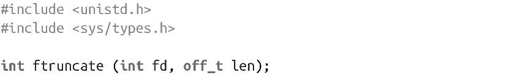
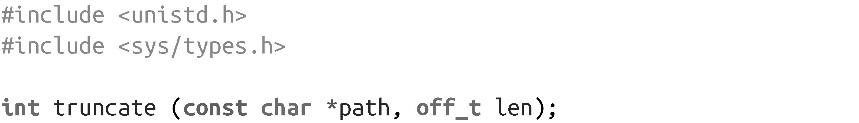
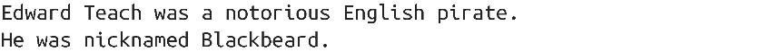
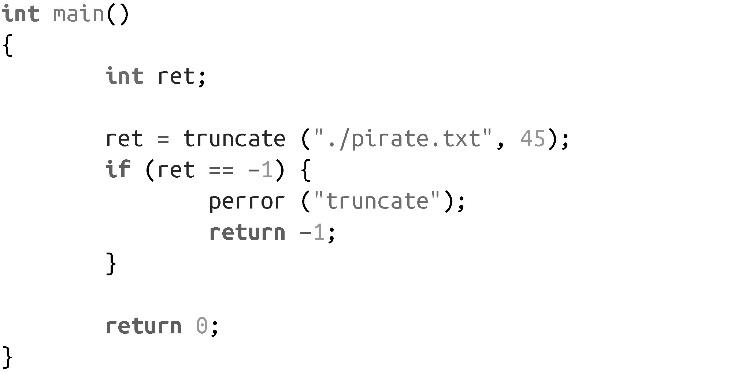

### 2.9　文件截短

Linux提供了两个系统调用支持文件长度截短，各个POSIX标准都（不同程度地）定义了它们，分别是：

和：

这两个系统调用都将给定文件截短为参数len指定的长度。ftruncate()系统调用在已经以可写方式打开的文件描述符fd上操作。truncate()系统调用在path指定的可写文件上操作。成功时都返回0，出错时都返回-1并相应设置errno值。

这些系统调用最常见的用法是把文件大小截短成比当前文件长度小。成功返回时，文件长度变成len，介于之前len和老的文件长度之间的数据会被丢弃，并不再可读。

这两个函数还可以把文件“截短”为比原长度更大，这和2.7.1小节中描述的查找写例子很相似。扩展出的字节都是用0填充。

这两个操作都不会修改当前文件位置。

举个例子，假设文件pirate.txt的长度是74字节，内容如下：

在相同目录下，运行以下代码：

其执行结果是生成了一个45字节的文件，内容如下：

