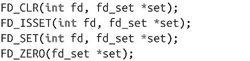
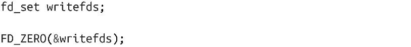
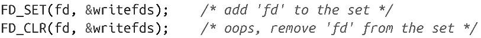
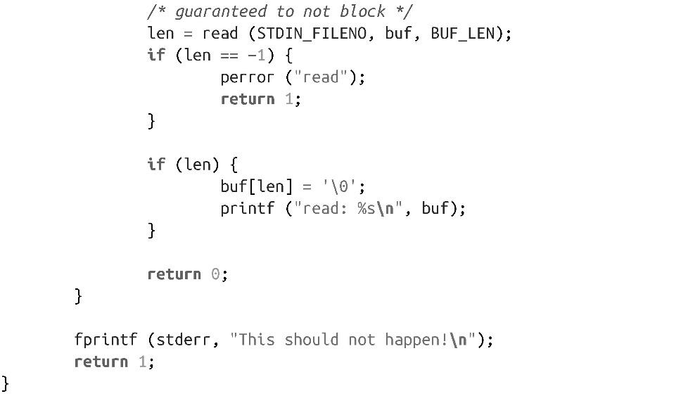
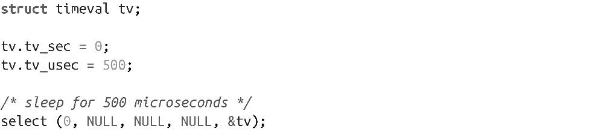
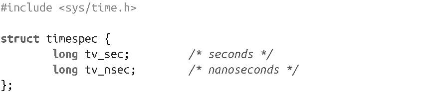

### 2.10.1　select()

select()系统调用提供了一种实现同步I/O多路复用的机制：

在给定的文件描述符I/O就绪之前并且还没有超出指定的时间限制，select()调用就会阻塞。

监视的文件描述符可以分为3类，分别等待不同的事件。对于readfds集中的文件描述符，监视是否有数据可读（即某个读操作是否可以无阻塞完成）；对于writefds集中的文件描述符，监视是否有某个写操作可以无阻塞完成；对于exceptfds中的文件描述符，监视是否发生异常，或者出现带外（out-of-band）数据（这些场景只适用于socket）。指定的集合可能是NULL，在这种情况下，select()不会监视该事件。

成功返回时，每个集合都修改成只包含相应类型的I/O就绪的文件描述符。举个例子，假定readfds集中有两个文件描述符7和9。当调用返回时，如果描述符7还在集合中，它在I/O读取时不会阻塞。如果描述符9不在集合中，它在读取时很可能会发生阻塞。（这里说的是“很可能”是因为在调用完成后，数据可能已经就绪了。在这种场景下，下一次调用select()就会返回描述符可用。）<a class="my_markdown" href="['#anchor26']">[6]</a>

第一个参数n，其值等于所有集合中文件描述符的最大值加1。因此，select()调用负责检查哪个文件描述符值最大，将该最大值加1后传给第一个参数。

参数timeout是指向timeval结构体的指针，定义如下：

如果该参数不是NULL，在tv_sec秒tv_usec微秒后。select()调用会返回，即使没有一个文件描述符处于I/O就绪状态。返回时，在不同的UNIX系统中，该结构体是未定义的，因此每次调用必须（和文件描述符集一起）重新初始化。实际上，当前Linux版本会自动修改该参数，把值修改成剩余的时间。因此，如果超时设置是5秒，在文件描述符可用之前已逝去了3秒，那么在调用返回时，tv.tv_sec的值就是2。

如果超时值都是设置成0，调用会立即返回，调用时报告所有事件都挂起，而不会等待任何后续事件。

不是直接操作文件描述符集，而是通过辅助宏来管理。通过这种方式，UNIX系统可以按照所希望的方式来实现。不过，大多数系统把集合实现成位数组。

FD_ZERO从指定集合中删除所有的文件描述符。每次调用select()之前，都应该调用该宏。

FD_SET向指定集中添加一个文件描述符，而FD_CLR则从指定集中删除一个文件描述符。

设计良好的代码应该都不需要使用FD_CLR，极少使用该宏。

FD_ISSET检查一个文件描述符是否在给定集合中。如果在，则返回非0值，否则返回0。当select()调用返回时，会通过FD_ISSET来检查文件描述符是否就绪：

由于文件描述符集是静态建立的，所以文件描述符数存在上限值，而且存在最大文件描述符值，这两个值都是由FD **_** SETSIZE设置。在Linux，该值是1024。我们将在本章稍后一起来看各种不同限制。

#### 返回值和错误码

select()调用成功时，返回三个集合中I/O就绪的文件描述符总数。如果给出了超时设置，返回值可能是0。出错时，返回-1，并把errno值设置成如下值之一：

EBADF

某个集合中存在非法文件描述符。

EINTR

等待时捕获了一个信号，可以重新发起调用。

EINVAL

参数n是负数，或者设置的超时时间值非法。

ENOMEM

没有足够的内存来完成该请求。

#### select()示例

我们来看看下面的示例代码，虽然简单但对select()用法的说明却非常实用。在这个例子中，会阻塞等待stdin的输入，超时设置是5秒。由于只监视单个文件描述符，该示例不算I/O多路复用，但它很清晰地说明了如何使用系统调用：

#### 用select()实现可移植的sleep功能

在各个UNIX系统中，相比微秒级的sleep功能，对select()的实现更普遍，因此select()调用常常被作为可移植的sleep实现机制：把所有三个集都设置NULL，超时值设置为非NULL。如下：

Linux提供了高精度的sleep机制。在第11章中，我们将详细说明它。

#### pselect()

select()系统调用很流行，它最初是在4.2BSD中引入的，但是POSIX标准在POSIX 1003.1g-2000和后来的POSIX 1003.1-2001中定义了自己的pselect()方法：

pselect()和select()存在三点区别：

+ pselect()的timeout参数使用了timespec结构体，而不是timeval结构体。timespec结构体使用秒和纳秒，而不是秒和毫秒，从理论上讲更精确些。但实际上，这两个结构体在毫秒精度上已经不可靠了。
+ pselect()调用不会修改timeout参数。因此，在后续调用中，不需要重新初始化该参数。
+ select()系统调用没有sigmask参数。当这个参数设置为NULL时，pselect()的行为和select()相同。

timespec结构体定义如下：

把pselect()添加到UNIX工具箱的主要原因是为了增加sigmask参数，该参数是为了解决文件描述符和信号之间等待而出现竞争条件（在第10章将深入讨论信号）。假设信号处理程序设置了全局标志位（大部分都如此），进程每次调用select()之前会检查该标志位。现在，假定在检查标志位和调用之间收到信号，应用可能会一直阻塞，永远都不会响应该信号。pselect()提供了一组可阻塞信号，应用在调用时可以设置这些信号来解决这个问题。阻塞的信号要等到解除阻塞才会处理。一旦pselect()返回，内核就会恢复老的信号掩码。

在Linux内核2.6.16之前，pselect()还不是系统调用，而是由glibc提供的对select()调用的简单封装。该封装对出现竞争的风险最小化，但是并没有完全消除竞争。当真正引入了新的系统调用pselect()之后，才彻底解决了竞争问题。

虽然和select()相比，pselect()有一定的改进，但大多数应用还是使用select()，有的是出于习惯，也有的是为了更好的可移植性。

