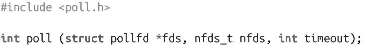
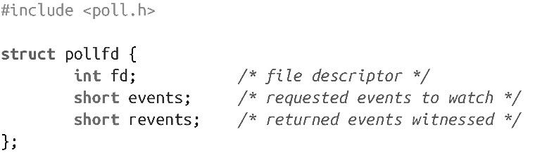
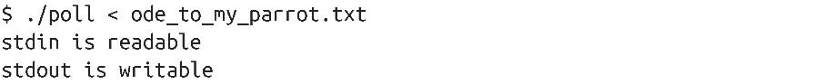
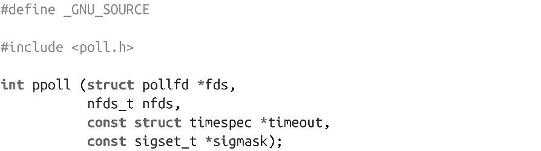

### 2.10.2　poll()

poll()系统调用是System V的I/O多路复用解决方案。它解决了一些select()的不足，不过select()还是被频繁使用（还是出于习惯或可移植性的考虑）：

select()使用了基于文件描述符的三位掩码的解决方案，其效率不高；和它不同，poll()使用了由nfds个pollfd结构体构成的数组，fds指针指向该数组。pollfd结构体定义如下：

每个pollfd结构体指定一个被监视的文件描述符。可以给poll()传递多个pollfd结构体，使它能够监视多个文件描述符。每个结构体的events变量是要监视的文件描述符的事件的位掩码。用户可以设置该变量。revents变量是该文件描述符的结果事件的位掩码。内核在返回时会设置revents变量。events变量中请求的所有事件都可能在revents变量中返回。以下是合法的events值：

POLLIN

有数据可读。

POLLRDNORM

有普通数据可读。

POLLRDBAND

有优先数据可读。

POLLPRI

有高优先级数据可读。

POLLOUT

写操作不会阻塞。

POLLWRNORM

写普通数据不会阻塞。

POLLBAND

写优先数据不会阻塞。

POLLMSG

有SIGPOLL消息可用。

此外，revents变量可能会返回如下事件：

POLLER

给定的文件描述符出现错误。

POLLHUP

给定的文件描述符有挂起事件。

POLLNVAL

给定的文件描述符非法。

对于events变量，这些事件没有意义，events参数不要传递这些变量，它们会在revents变量中返回。poll()和select()不同，不需要显式请求异常报告。

POLLIN | POLLPRI等价于select()的读事件，而POLLOUT | POLLWRBAND等价于select()的写事件。POLLIN等价于POLLRDNORM | POLLRDBAND，而POLLOUT等价于POLLWRNORM。

举个例子，要监视某个文件描述符是否可读写，需要把events设置成POLLIN | POLLOUT。返回时，会检查revents中是否有相应的标志位。如果设置了POLLIN，文件描述符可非阻塞读；如果设置了POLLOUT，文件描述符可非阻塞写。标志位并不是相互排斥的：可以同时设置，表示可以在该文件描述符上读写，而且都不会阻塞。

timeout参数指定等待的时间长度，单位是毫秒，不论是否有I/O就绪，poll()调用都会返回。如果timeout值为负数，表示永远等待；timeout为0表示poll()调用立即返回，并给出所有I/O未就绪的文件描述符列表，不会等待更多事件。在这种情况下，poll()调用如同其名，轮询一次后立即返回。

#### 返回值和错误码

poll()调用成功时，返回revents变量不为0的所有文件描述符个数；如果没有任何事件发生且未超时，返回0。失败时，返回-1，并相应设置errno值如下：

EBADF

一个或多个结构体中存在非法文件描述符。

EFAULT

fds指针指向的地址超出了进程地址空间。

EINTR

在请求事件发生前收到了一个信号，可以重新发起调用。

EINVAL

nfds参数超出了RLIMIT **_** NOFILE值。

ENOMEM

可用内存不足，无法完成请求。

#### poll()示例

我们一起来看一下poll()的示例程序，它同时检测stdin读和stdout写是否会发生阻塞：

运行后，生成结果如下（和期望一致）：

再次运行，这次把一个文件重定向到标准输入，可以看到两个事件：

如果在实际应用中使用poll()，不需要在每次调用时都重新构建pollfd结构体。该结构体可能会被重复传递多次，内核会在必要时把revents清空。

#### ppoll()

类似于pselect()和select()，Linux也为poll()提供了ppoll()。然而，和pselect()不同，ppoll()是Linux特有的调用：

类似于pselect()，timeout参数指定的超时时间是秒和纳秒，sigmask参数提供了一组等待处理的信号。

