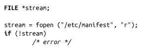

### 模式

参数mode描述如何打开指定文件。它可以是以下字符串之一：

r

以只读模式打开文件。流指针指向文件的开始。

r+

以可读写模式打开文件。流指针指向文件的开始。

w

以只写模式打开文件。如果文件存在，文件会被清空。如果文件不存在，就会被创建。流指针指向文件的开始。

w+

以可读写模式打开文件。如果文件存在，文件会被清空。如果文件不存在，就会被创建。流指针指向文件的开始。

a

以追加写模式打开文件。如果文件不存在，就会被创建。流指针指向文件的末尾。所有的写入都是追加到文件的末尾。

a+

以追加读写模式打开文件。如果文件不存在，就会被创建。流指针指向文件的末尾。所有的写入都是追加到文件的末尾。

> 给定模式可能还包含字符b，虽然该值在Linux下通常会被忽略。有些操作系统用不同的模式处理文本和二进制文件，b模式表示以二进制方式打开文件。对于Linux，以及所有遵循POSIX的操作系统，对文本文件和二进制文件的处理没有任何区别。

fopen()执行成功时，返回一个合法的FILE指针。失败时，返回NULL，并相应设置errno值。

举个例子，以下代码以只读方式打开/etc/manifest，并将它与流关联：

