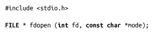
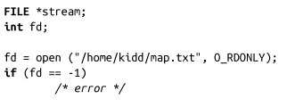

### 3.4　通过文件描述符打开流

函数fdopen()会把一个已经打开的文件描述符（fd）转换成流：

fdopen()的可能模式和fopen()相同，而且必须和初始打开文件描述符的模式匹配。可以指定模式w和w+，但是它们不会清空原文件。流指针指向文件描述符指向的文件位置。

一旦文件描述符被转换成流，则在该文件描述符上不应该直接执行I/O操作，虽然这么做是合法的。需要注意的是，文件描述符并没有被复制，而只是关联了一个新的流。关闭流也会关闭相应的文件描述符。

fdopen()执行成功时，返回一个合法的文件指针；失败时，返回NULL并设置相应的errno值。

举个例子，以下代码通过open()系统调用打开/home/kidd/map.txt文件，然后通过该文件描述符创建一个关联的流：

