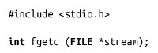
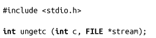

### 3.6.1　每次读取一个字节

通常情况下，理想的I/O模式是每次读取一个字符。函数fgetc()可以用来从流中读取单个字符：

该函数从stream中读取一个字符，并把该字符强制类型转换成unsigned int返回。强制类型转换是为了能够表示文件结束或错误：在这两种情况下都会返回EOF。fgetc()的返回值必须保存成int类型。把返回值保存为char类型是经常犯的危险错误，因为这么做会漏掉错误检查。

下面这个例子会从stream中读取一个字符，检查错误，然后以字符方式打印结果：

stream指向的流必须以可读模式打开。

#### 把字符放回到流中

标准输入输出提供了一个函数可以把字符放回到流中。当读取流的最后一个字符，如果不需要该字符的话，可以把它放回流中。

每次调用会把int c强制类型转换成unsigned char，并放回到stream中。成功时，返回c；失败时，返回EOF。stream的下一次读请求会返回c。如果有多个字符被放回流中，读取时会以相反的顺序返回——也就是说，最后放回的字符先返回。C标准指出，只保证一次放回成功，而且还必须中间没有读请求。因此，有些实现只支持一次放回。只要有足够的内存，Linux允许无限次放回。当然，一次放回总是成功。

如果在调用ungetc()之后，但在发起下一个读请求之前，发起了一次seek函数调用（见3.9节），会导致所有放回stream中的字符被丢弃。在单个进程的多线程场景中会发生这种情况，因为所有的线程共享一个缓冲区。

