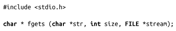
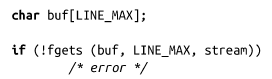
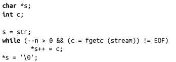
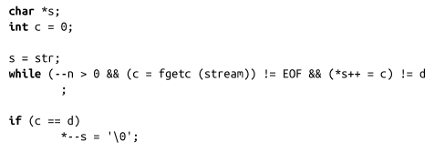
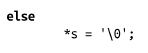

### 3.6.2　每次读一行

函数fgets()会从指定流中读取一个字符串：

该函数从stream中读取 size-1个字节的数据，并把结果保存到str中。 读完最后一个字节后，缓冲区中会写入空字符（\0）。当读到EOF或换行符时，会结束读。如果读到换行符，会把\n写入到str中。

fgets()成功时，返回str；失败时，返回NULL。

例如：

POSIX在<limits.h>中定义了宏LINE **_** MAX：LINE **_** MAX是POSIX的行控制接口能够处理的输入行的最大长度。Linux的C函数库没有这样的限制（行可以是任意长度），但无法获取宏LINE **_** MAX值。可移植程序可以使用LINE **_** MAX来保证安全；在Linux系统中，该值设置得相对较大。Linux特有的程序无需担心行大小的限制。

#### 读取任意字符串

通常而言，基于行的读取fgets()函数是很有用的。但是很多时候，它又会带来很多麻烦。在某些场景，开发人员希望可以自己设置分隔符而不是使用换行符。还有一些场景，开发人员根本就不想要分隔符——而且他们更不希望在缓冲区中保存分隔符。现在重新回顾，在返回的缓冲区中保存换行符基本上被证明了是错误的。

通过fgetc()实现fgets()的功能并不难。例如，以下代码片段从stream中读取n-1个字节到str中，然后追加上一个\0字符：

可以对这段程序进行扩展，支持在任意指定的分隔符d处停止读数据（在本例中，整数类型d不能是空字符）：

把d设置为\n可以实现和fgets()类似的功能，而且不会在缓冲区中存入换行符。

和fgets()的实现相比，以上这种实现方式可能要慢些，因为它重复调用了很多次fgetc()。但是，它和我们最开始的dd示例不同。虽然这段代码带来了额外的函数调用代价，但和dd示例中设置bs=1不同，它并没有带来额外的系统调用代价以及I/O块不对齐造成的低效，而相对来讲，后者会产生更大的问题。

