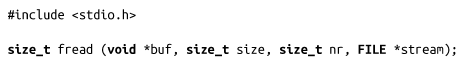
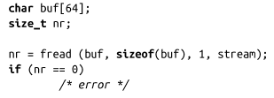

### 3.6.3　读二进制文件

对于某些应用，每次读取一个字符或一行是不够的。在某些场景下，开发人员希望读写复杂的二进制数据，比如C结构体。为了解决这个entire，标准I/O库提供了fread()函数：

调用fread()会从stream中读取nr项数据，每项size个字节，并将数据保存到buf所指向的缓冲区。文件指针向前移动读出数据的字节数。

返回读到的数据项的个数（注意：不是读入字节的个数!）。如果读取失败或文件结束，fread()函数会返回一个比nr小的数。不幸的是，必须使用ferror()或feof()函数（见3.11节），才能确定是失败还是文件结束。

由于变量大小、对齐、填充、字节序这些因素的不同，由一个应用程序写入的二进制文件，另一个应用程序可能无法读取，甚至同一个应用程序在另一台机器上也无法读取。

关于fread()，最简单的例子是从给定流中读取一个线性大小的数据项：

当学习和fread()相对应的fwrite()时，会给出一些更复杂的示例。

**细说“对齐”** 
 所有的计算机体系结构都需要数据对齐（data alignment）。编程人员往往把内存简单地看成一个字节数组。但是，处理器并不是以字节大小的块对内存进行读写。相反地，处理器以特定的粒度（如2、4、8字节或16字节）来访问内存。因为每个进程的地址空间都是从地址0开始的，进程必须从特定粒度的整数倍开始读取。 
 因此，C变量的存储和访问都要求地址对齐。一般而言，变量是自动对齐的，这指的是和C数据类型大小相关的对齐。例如，一个32位整数占用4个字节，它每4个字节会对齐。换句话说，在大多数体系结构中，int需要存储在能被4整除的内存地址中。 
 访问不对齐的数据会带来不同程度的性能问题，这取决于不同的体系结构。有些处理器能够访问不对齐的数据，但是会有很大性能损失。有些处理器根本就无法访问不对齐的数据，尝试这么做会导致硬件异常。更糟的是，有些处理器为了强制地址对齐，会丢弃了低位的数据，从而导致不可预料的行为。 
 通常，编译器会自动对齐所有的数据，而且对程序员而言，对齐是“透明”的。处理结构体，手动执行内存管理，把二进制数据保存到磁盘中，以及网络通信都会涉及对齐问题。因此，系统程序员应当对这些问题了如指掌。 
 第9章会更深入探讨对齐相关的问题。

