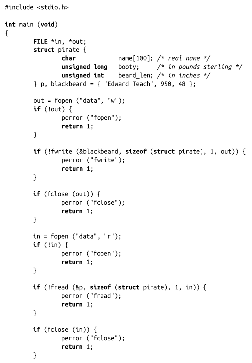
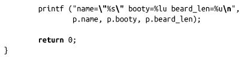
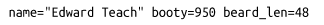

### 3.8　缓冲I/O示例程序

现在我们一起来看个示例（其实是个完整的程序），它涵盖了本章前面涉及的许多接口。该程序首先定义了一个结构体pirate，然后声明了两个该类型的变量。程序对其中的一个变量初始化，然后通过输出流把它写入磁盘文件data中。程序通过另一个流，直接从data中读取数据存储到pirate结构的另一个实例中。最后，程序把该pirate结构的内容输出到标准输出：

显然，输出结果和原始值一致：

再次强调一下，由于变量长度、对其等因素的不同，一个应用程序所写入的数据可能另一个应用程序不可读。也就是说，不同的应用程序——甚至是不同机器上的同一个应用程序——都可能无法正确读取fwrite()所写入的数据。在这个例子中，假如unsigned long大小改变，或者填充的字节数发生变化，都会导致不可读。这些因素只能在ABI相同的特定机器上才能保证一致。

