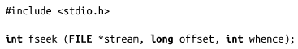
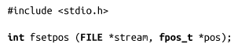
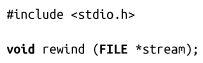
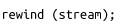
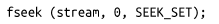
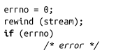

### 3.9　定位流

通常，控制当前流的位置是很有用的。可能应用程序正在读取复杂的、基于记录的文件，而且需要跳跃式读取。有时，需要把流重新设置成指向初始位置。在任何情况下，标准I/O提供了一系列功能等价于系统调用lseek()的函数（在第2章中讨论过）。fseek()函数是标准I/O最常用的定位函数，控制stream指向文件中由参数offset和whence确定的位置：

如果参数whence设置为SEEK **_** SET，stream指向的文件位置即offset。如果whence设置为SEEK **_** CUR，stream指向的文件位置即当前位置加上offset。如果whence设置为SEEK **_** END，stream指向的文件位置即文件末尾加上offset。

fseek()函数成功时，返回0，并清空文件结束标志符EOF，取消（如果有的话）ungetc()操作。出错时，返回1，并相应设置errno值。最常见的错误包括两种：流非法（EBADF）和whence参数非法（EINVAL）。

此外，标准I/O还提供fsetpos()函数：

fsetpos()函数会把stream的流指针指向pos。它的功能和把fseek()函数的whence设置成SEEK **_** SET时一致。成功时，返回0；否则，返回-1，并且相应地设置errno值。该函数（和下面很快要介绍的fgetpos()函数对应）只是为了给其他通过复杂数据类型表示流位置的平台（非UNIX）使用。在这些平台上，fsetpos()函数是唯一能够将流位置设置为任意值的方法，因为Ｃ的long整型可能不够大。Linux上编程一般不使用这个接口，除非希望能够在所有的平台上可移植。

标准I/O也提供了rewind()函数，可以很方便使用：

该调用：

会把位置重新设置成流的初始位置。它的功能等价于：

唯一的区别在于rewind会清空错误标识。

注意rewind()没有返回值，因此无法直接提供出错信息。调用函数如果希望获取错误，需要在调用之前清空errno值，并且检查该变量值在调用之后是否非零。举个例子：

