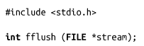

### 3.10　Flush（刷新输出）流

标准I/O库提供了一个接口，可以将用户缓冲区写入内核，并且保证写到流中的所有数据都通过write()函数flush输出。fflush()函数提供了这一功能：

调用该函数时，stream指向的流中所有未写入的数据会被 flush到内核中。如果stream是空的（NULL），进程中所有打开的流会被flush。成功时，fflush()返回0。失败时，返回EOF，并相应设置errno值。

为了更好地理解fflush()函数的功能，需要理解C函数库维持的缓冲区和内核本身的缓冲区之间的区别。本章提到的所有调用所需要的缓冲区都是由C函数库来维护的，它是在用户空间，而不是内核空间。也就是说，这些调用的性能提升空间来自于用户空间，运行的是用户代码，而不是系统调用。只有当需要访问磁盘或其他某些介质时，才会发起系统调用。

fflush()函数的功能只是把用户缓冲的数据写入到内核缓冲区。其执行结果是看起来似乎没有用户缓冲区，而是直接调用 write()函数。fflush()函数并不保证数据最终会写到物理介质上——如果需要这个功能，应该使用fsync()这类函数（参见2.4节）。为了确保数据最终会写到备份存储（backing store）中，可以如下来完成——在调用fflush()后，立即调用fsync(): 也就是说，先保证用户缓冲区被写入到内核，然后保证内核缓冲区被写入到磁盘。

