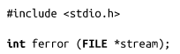
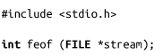
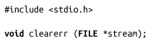
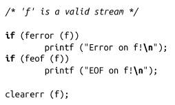

### 3.11　错误和文件结束

对于某些标准I/O接口，如fread()函数，把失败信息返回给调用方做得很不友好，因为它们没有提供机制可以区分错误和文件结束（EOF）。对于这些调用，在某些场合需要检查流的状态，从而区分是出现错误还是达到文件结尾。标准I/O为此提供了两个接口。函数ferror()用于判断给定的stream是否有错误标志：

错误标志由其他标准I/O接口在响应某种错误情况时设置。如果错误标志被设置，ferror()函数返回非0值，否则返回0。

函数feof()用于判断指定stream是否设置了文件结束标志：

当到达文件结尾时，其他标准I/O函数会设置EOF标志。如果设置了EOF标志，feof()函数会返回非0值，否则返回0。

clearerr()函数会清空指定stream的错误和EOF标志：

clearer()函数没有返回值，而且不会失败（因此无法判断是否提供的是一个非法的流）。只有检查了错误标志和EOF标志后，才可以调用clearerr()，因为清空操作是不可恢复的。例如：

