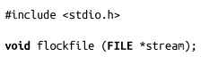
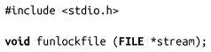
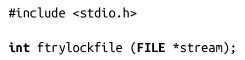
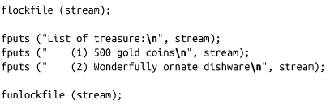

### 3.14.1　手动文件加锁

函数flockfile()会等待指定stream被解锁，然后增加自己的锁计数，获得锁，该函数的执行线程成为流的持有者，并返回：

函数funlockfile() 会减少和指定stream关联的锁计数：

如果锁计数值为0，当前线程会放弃对该流的持有权，另一个线程可以获得该锁。

这些调用可以嵌套。也就是说，单个线程可以执行多次flockfile()调用，而直到该进程执行相同数量的funlockfile()调用后，该流才会被解锁。

ftrylockfile()函数是flockfile()函数的非阻塞版：

如果指定stream流当前已经加锁，ftrylockfile()函数不做任何处理，会立即返回一个非0值。如果指定stream当前并没有加锁，执行ftrylockfile()的线程会获得锁，增加锁计数值，成为该stream的持有者，并返回0。

我们来看下面这个例子。假设需要向一个文件中写多行数据，保证在写数据时多个线程的写操作不会交织在一起：

尽管各个fputs()操作不会和其他I/O操作造成竞争——比如“List of treasure”的输出中间不会夹杂任何东西——另一个线程对该流的其他标准I/O操作线程可能会夹杂在当前线程的两个fputs()语句之间。理想情况下，应用在设计上应该避免多个线程向同一个流提交 I/O操作。但是，如果应用确实需要这么做，并且需要一个比单个函数调用更大的原子操作区域，flockfile()及其相关函数可以解决这个问题。

