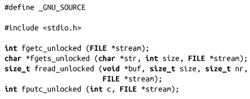
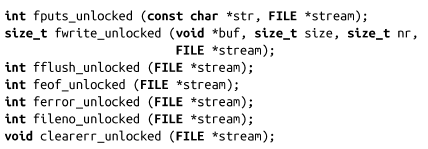

### 3.14.2　对流操作解锁

手动给流加锁还有另外一个原因。只有应用开发者才能提供更精细、更准确的锁控制，这样才可以将加锁的代价降到最小，并提高效率。为此，Linux提供了一系列函数，类似于常见的标准I/O接口，但是不执行任何锁操作。实际上，这些锁是不加锁的标准I/O：

除了不检查或获取指定stream上的锁以外，这些函数和其对应的加锁函数功能完全相同。如果需要加锁，程序员需要确保手工获得并释放锁。

>  **委托I/O（Relegating I/O）**
> 使用不加锁的标准I/O函数，会带来可观的性能提升。此外，不需要考虑使用flockfile()函数的复杂的加锁操作，代码会简洁很多。在设计应用时，考虑把所有的I/O委托给单个线程（或者把所有I/O委托给线程池，每个流映射到线程池中的一个线程）。

虽然POSIX定义了一些不加锁的标准I/O函数，但以上这些函数都不是POSIX定义的。它们都是Linux所特有的，虽然很多其他UNIX系统支持以上某些函数。

我们将在第7章详细探讨线程。

