### readv()和writev()

Linux实现了POSIX 1003.1-2001中定义的一组实现分散/聚集I/O机制的系统调用。该实现满足了上节所述的所有特性。

readv()函数从文件描述符fd中读取count个段（segment）<a class="my_markdown" href="['#anchor41']">[1]</a>到参数iov所指定的缓冲区中：

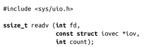
writev()函数从参数iov指定的缓冲区中读取count个段的数据，并写入fd中：

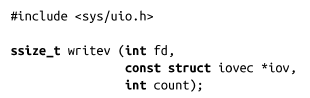
除了同时操作多个缓冲区外，readv()函数和writev()函数的功能分别和read()、write()的功能一致。

每个iovec结构体描述一个独立的、物理不连续的缓冲区，我们称其为段（segment）：

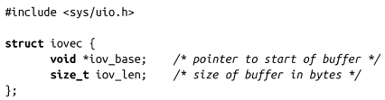
一组段的集合称为向量（vector）。每个段描述了内存中所要读写的缓冲区的地址和长度。readv()函数在处理下个缓冲区之前，会填满当前缓冲区的iov_len 个字节。 writev()函数在处理下个缓冲区之前，会把当前缓冲区所有iov_len个字节数据输出。这两个函数都会顺序处理向量中的段，从iov[0]开始，接着是iov[1]，一直到iov[count-1]。

#### 返回值

操作成功时，readv()函数和writev()函数分别返回读写的字节数。该返回值应该等于所有count个iov_len的和。出错时，返回-1，并相应设置errno值。这些系统调用可能会返回任何read()和write()可能返回的错误，而且出错时，设置的errno值也与read()、write()相同。此外，标准还定义了另外两种错误场景。

第一种场景，由于返回值类型是ssize_t，如果所有count个iov_len的和超出SSIZE_MAX，则不会处理任何数据，返回-1，并把errno值设置为EINVAL。

第二种场景，POSIX 指出count值必须大于0，且小于等于IOV_MAX（IOV_MAX在文件<limits.h>中定义）。在Linux中，当前IOV_MAX的值是1 024。如果count为0，该系统调用会返回0<a class="my_markdown" href="['#anchor42']">[2]</a>。 如果count大于IOV_MAX，不会处理任何数据，返回-1，并把errno值设置为EINVAL。

>  **优化count值**
> 在向量I/O操作中，Linux内核必须分配内部数据结构来表示每个段（segment）。一般来说，是基于count的大小动态分配进行的。然而，为了优化，如果count值足够小，内核会在栈上创建一个很小的段数组，通过避免动态分配段内存，从而获得性能上的一些提升。count的阈值一般设置为8，因此如果count值小于或等于8时，向量I/O操作会以一种高效的方式，在进程的内核栈中运行。
> 大多数情况下，无法选择在指定的向量I/O 操作中一次同时传递多少个段。当你认为可以试用一个较小值时，选择8或更小的值肯定会得到性能的提升。

#### writev()示例

我们一起看一个简单的例子，向量包含3个段，且每个段包含不同长度的字符串，看它是如何把这3个段写入一个缓冲区的。以下这个程序足以演示writev()的功能，同时也是一段有用的代码片段：

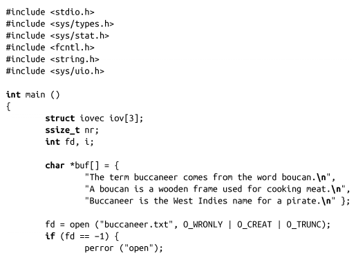

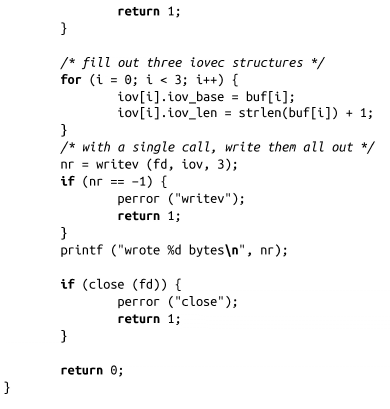
运行该程序，会生成如下结果：

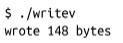
读取该文件，内容如下：

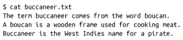
#### readv()示例

现在我们通过readv()函数从前面生成的文本文件读取数据。这个程序同样也很简单：

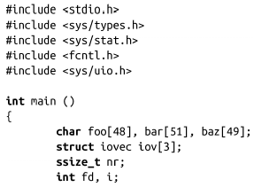

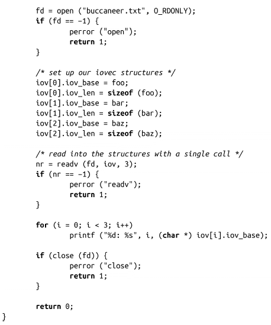
在运行前一个程序后，再运行该程序，输出结果如下：

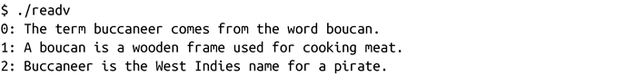
#### 实现

可以在用户空间简单实现readv()函数和writev()函数，代码看起来如下：

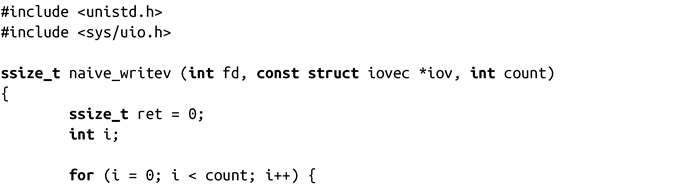

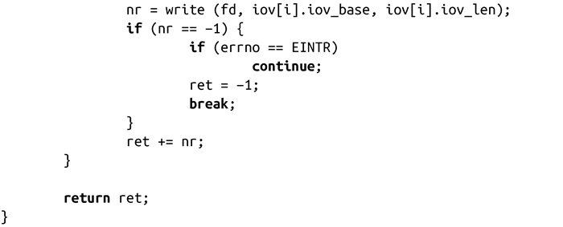
幸运的是，Linux内核不是这么实现的：Linux把readv()和writev()作为系统调用实现，在内部使用分散/聚集 I/O模式。实际上，Linux内核中的所有I/O都是向量I/O，read()和write()是作为向量I/O实现的，且向量中只有一个段。

