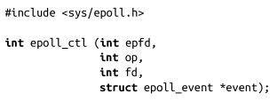
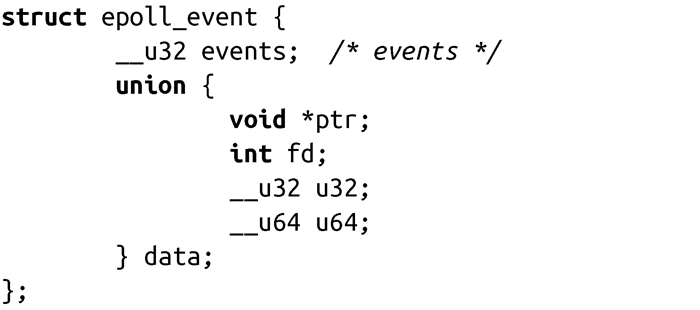
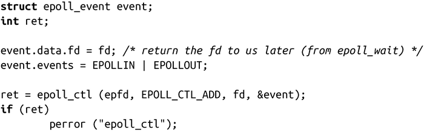
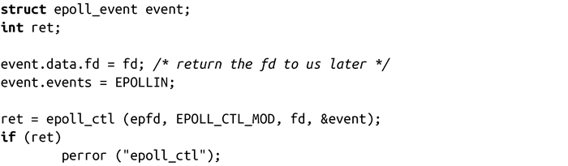
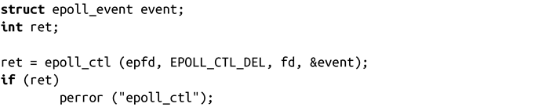

### 4.2.2　控制epoll

epoll_ctl()函数可以向指定的epoll上下文中加入或删除文件描述符：

头文件<sys/epoll.h>中定义了epoll event结构体：

epoll_ctl()调用如果执行成功，会控制和文件描述符epfd关联的epoll实例。参数op指定对fd指向的文件所执行的操作。参数event进一步描述epoll更具体的行为。

以下是参数op的有效值：

EPOLL_CTL_ADD

把文件描述符fd所指向的文件添加到epfd指定的epoll监听实例集中，监听event中定义的事件。

EPOLL_CTL_DEL

把文件描述符fd所指向的文件从epfd指定的epoll监听集中删除。

EPOLL_CTL_MOD

使用event指定的更新事件修改在已有fd上的监听行为。

epoll_events结构体中的events变量列出了在指定文件描述符上要监听的事件。多个监听事件可以通过位或运算同时指定。以下为有效的events值：

EPOLLERR

文件出错。即使没有设置，这个事件也是被监听的。

EPOLLET

在监听文件上开启边缘触发（edge-triggered）。（参见4.2.4小节。）默认是条件触发（level-triggered）。

EPOLLHUP

文件被挂起。即使没有设置，这个事件也是被监听的。

EPOLLIN

文件未阻塞，可读。

EPOLLONESHOT

在事件生成并处理后，文件不会再被监听。必须通过EPOLL_CTL_MOD指定新的事件掩码，以便重新监听文件。

EPOLLOUT

文件未阻塞，可写。

EPOLLPRI

存在高优先级的带外（out-of-band）数据可读。

event_poll中的data变量是由用户私有使用。当接收到请求的事件后，data会被返回给用户。通常的用法是把event.data.fd设置为fd，这样可以很容易查看哪个文件描述符触发了事件。

当成功时，epoll_ctl()返回0。失败时，返回-1，并相应设置errno为下列值：

EBADF

epfd不是有效的epoll实例，或者fd不是有效的文件描述符。

EEXIST

op值设置为EPOLL_CTL_ADD，但是fd已经与epfd关联。

EINVAL

epfd不是epoll实例，epfd和fd相同，或op无效。

ENOENT

op值设置为EPOLL_CTL_MOD或EPOLL_CTL_DEL，但是fd没有和epfd关联。

ENOMEN

没有足够的内存来处理请求。

EPERM

fd不支持epoll。

在下面的例子中，在epoll实例epfd中加入fd所指向文件的监听事件，代码如下：

修改epfd实例中的fd上的一个监听事件，代码如下：

相反，从epoll实例epfd中删除在fd上的一个监听事件，代码如下：

需要注意的是，当op设置为EPOLL_CTL_DEL时，由于没有提供事件掩码，event参数可能会是NULL。但是，在2.6.9以前的内核版本中，会检查该参数是否非空。为了和老的内核版本保持兼容，必须传递一个有效的非空指针，该指针不能只是声明。内核2.6.9版本修复了这个bug。

