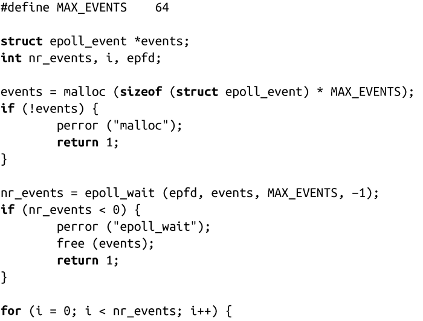
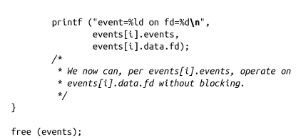

### 4.2.3　等待epoll事件

系统调用epoll_wait()会等待和指定epoll实例关联的文件描述符上的事件：

当调用epoll_wait()时，等待epoll实例epfd中的文件fd上的事件，时限为timeout毫秒。成功时，events指向描述每个事件的epoll_event结构体的内存，且最多可以有maxevents个事件，返回值是事件数；出错时，返回1，并将errno设置为以下值：

EBADF

epfd是一个无效的文件描述符。

EFAULT

进程对events所指向的内存没有写权限。

EINTR

系统调用在完成前发生信号中断或超时。

EINVAL

epfd不是有效的epoll实例，或者maxevents值小于或等于0。

如果timeout为0，即使没有事件发生，调用也会立即返回0。如果timeout为1，调用将一直等待到有事件发生才返回。

当调用返回时，epoll_event结构体中的events变量描述了发生的事件。data变量保留了用户在调用epoll_ctl()前的所有内容。

一个完整的epoll_wait()例子如下：

我们将在第9章探讨malloc()函数和free()函数。

