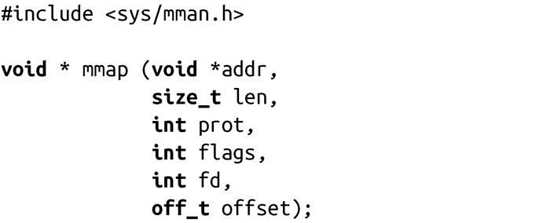
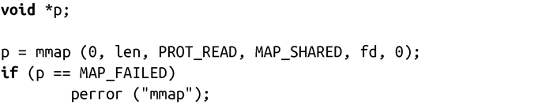
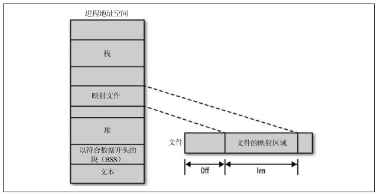
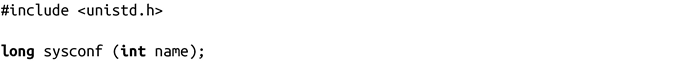
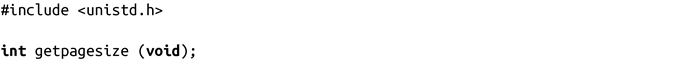
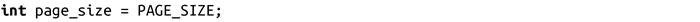

### 4.3.1　mmap()

mmap()调用请求内核将文件描述符fd所指向的对象的len个字节数据映射到内存中，起始位置从offset开始。如果指定addr，表示优先使用addr作为内存中的起始地址。参数prot指定了访存权限，flags指定了其他操作行为。

addr参数告诉内核映射文件的最佳地址，但仅仅是作为提示信息，而不是强制性的，大部分用户对该参数传递0。调用返回内存映射区域的真实开始地址。

prot参数描述了对内存区域所请求的访问权限。如果是PROT_NONE，表示无法访问映射区域的页（基本上不用），也可以是以下标志位的比特位或运算值：

PROT_READ 页可读。

PROT_WRITE 页可写。

PROT_EXEC 页可执行。

prot参数所设置的访存权限不能和打开文件的访问模式冲突。举例来说，如果程序以只读方式打开文件，prot参数就不能设置为PROT_WRITE。

**保护标志，体系结构和安全性** 
 虽然POSIX标准定义了三种保护位（读，写和执行），一些体系结构只支持其中几个。这很正常，比如对于处理器而言，读和执行没有区别。因此，处理器可能只有一个读标志。在这些操作系统上，PROT_READ即PROT_EXEC。不久之前，体系结构x86还属于这样的系统。 
 当然，依赖这样的处理方式会导致程序不可移植。可移植的程序在执行映射代码时，都应该相应设置PROT_EXEC。 
 从另一面来说，这是造成缓冲区溢出攻击盛行的原因之一：即使指定的映射没有执行权限，处理器还是支持执行。 
 最近，x86处理器加入了NX（no-execute）位，它表示映射允许读，但不可执行。在新的系统上，PROT_READ不再表示PROT_EXEC。

flag参数描述了映射的类型及其一些行为。其值为以下值按位或运算的结果：

MAP_FIXED

表示mmap()应该强制接收参数addr，而不是作为提示信息。如果内核无法映射文件到指定地址，调用失败。如果地址和长度指定的内存和已有映射有重叠区域，重叠区的原有内容被丢弃，通过新的内容填充。该选项需要深入了解进程的地址空间，不可移植，因此不鼓励使用。

MAP_PRIVATE

表示映射区不共享。文件映射采用了写时复制<a class="my_markdown" href="['#anchor44']">[4]</a>，进程对内存的任何改变不影响真正的文件或者其他进程的映射。

MAP_SHARED

表示和所有其他映射该文件的进程共享映射内存。对内存的写操作等效于写文件。读该映射区域会受到其他进程的写操作的影响。

MAP_SHARED和MAP_PRIVATE必须指定其中一个，但不能同时指定。第9章将会讨论更多更高级的标志。

当映射文件描述符时，文件的引用计数会加1。因此，如果映射文件后关闭文件，进程依然可以访问该文件。当你取消映射或者进程终止时，对应的文件引用计数会减1。

下面的示例代码中以只读方式映射到fd所指向的文件，从第1个字节开始，长度为len个字节：

图4-1显示了mmap()参数对文件与进程地址空间映射的影响。

<b class="my_markdown">图4-1　把文件映射到进程地址空间</b>

#### 页大小

页是内存管理单元（MMU）的粒度单位。因此，它是内存中允许具有不同权限和行为的最小单元。页是内存映射的基本块，因而也是进程地址空间的基本块。

mmap()系统调用的操作单元是页。参数addr和offset都必须按页大小对齐。也就是说，它们必须是页大小的整数倍。

所以，映射区域是页大小的整数倍。如果调用方提供的len参数没有按页对齐（可能是因为需要映射的文件大小不是页大小的整数倍），映射区域会一直占满最后一个页。多出来的内存，即最后一个有效字节到映射区域边界这一部分区域，会用0填充。 该区域的所有读操作都将返回0。所有写操作都不会影响文件的最后部分，即使使用参数MAP_SHARED进行映射，只有最前面的len个字节会写到文件中。

标准POSIX规定，获得页大小的方法是通过sysconf()函数，它将返回一系列系统特定的信息：

sysconf()调用会返回配置项name值，如果name无效，返回-1。出错时，errno被设置为EINVAL。因为-1对于某些项而言可能是有效值（比如对于limits，-1表示没有限制），明智的做法是在调用前清空errno，并在调用后检查其值来判断是否出错。

POSIX定义_SC_PAGESIZE（_SC_PAGE_SIZE与其同义）表示页大小。因此，在运行时获取页大小其实很简单：

Linux也提供了getpagesize()函数来获得页大小：

调用getpagesize()将返回页按字节计数的大小。使用也比sysconf()简单：

并不是所有的UNIX系统都支持这个函数，POSIX 1003.1-2001弃用了该函数，在这里包含它，只是出于完整性考虑。

页大小是由<asm/pages.h>中的宏PAGE_SIZE定义的。因此，第三种获取页大小的方式是：

和前两种方式不同，这种方法是在编译时获得页大小，而不是在运行时。一些体系结构支持多种机型使用不同页大小，某些机型本身甚至支持多种页大小。一个二进制文件应该能在指定体系结构下的所有机型上运行，即一次编译，到处运行。对页大小硬编码则会使这种可能性为0。因此，正确的做法是在运行时确定页大小。因为参数addr和offset通常设置为0，在运行时确定其实并不是很困难。

此外，未来的内核版本可能不会将该宏开放给用户空间。本章提到它是因为它在UNIX代码中使用很频繁，但是请不要在你自己的程序中使用它。目前看来，为了可移植性和今后的兼容性，sysconf()是最好的选择。

#### 返回值和错误码

成功时，mmap()返回映射区域的地址。失败时，返回MAP_FAILED，并相应设置errno值。mmap()调用永远都不会返回0。

可能的errno值如下：

EACESS 指定的文件描述符不是普通文件，或者打开模式和参数prot或flags冲突。

EAGAIN 文件已通过文件锁锁定。

EBADF 指定文件描述符非法。

EINVAL 参数addr、len、off中的一个或多个非法。

ENFILE 打开文件数达到系统上限。

ENODEV 文件所在的文件系统不支持存储映射。

ENOMEM 内存不足。

EOVERFLOW 参数addr + len的结果值超过了地址空间大小。

EPERM 设定了参数PROT_EXEC，但是文件系统以不可执行方式挂载。

#### 相关信号

和映射区域相关的两个信号如下：

SIGBUS 当进程试图访问一块已经失效的映射区域时，会生成该信号。例如，文件在映射后被截断（truncated）。

SIGSEGV 当进程试图写一块只读的映射区域时，会生成该信号。

