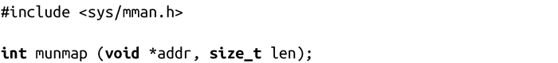
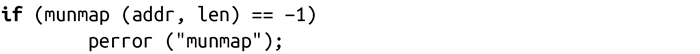

### 4.3.2　munmap()

Linux提供了munmap()系统调用，来取消mmap()所创建的映射。

munmap()会消除进程地址空间从addr开始，len字节长的内存中的所有页面的映射。一旦映射被消除，之前关联的内存区域就不再有效，如果试图再次访问会生成SIGSEGV信号。

一般来说，传递给munmap()的参数是上一次mmap()调用的返回值及其参数len。

成功时，munmap()返回0；失败时，返回-1，并相应设置errno值。唯一标准的errno值是EINVAL，它表示一个或多个参数无效。

举个例子，下面这个代码段消除了内存中[addr, addr + len]区间内所有页的映射：

