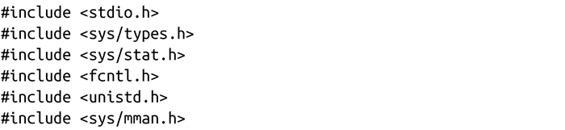
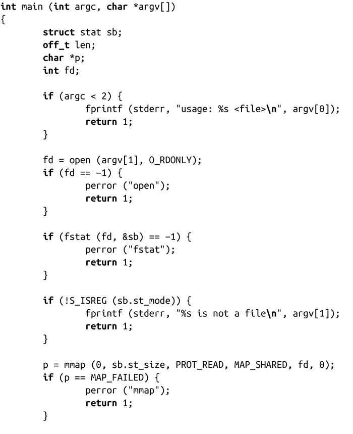
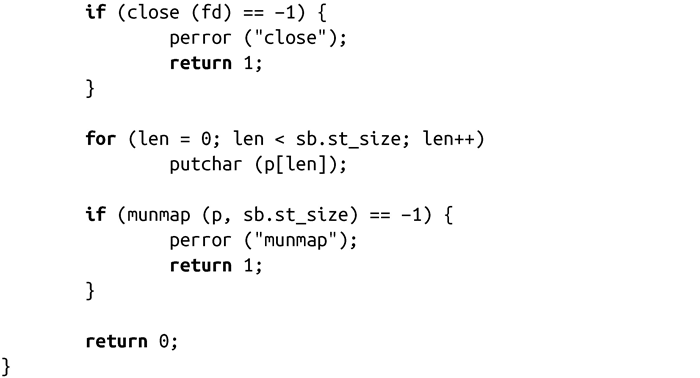

### 4.3.3　存储映射实例

下面，我们来看一个简单的实例，它使用mmap()将用户选择的文件输出到标准输出：

在本例中，唯一暂未介绍的系统调用是fstat()，我们将在第8章提到它。现在，你只需要了解fstat()返回指定文件的信息。S_ISREG()宏可以检查这些信息，这样我们可以在映射前确保指定文件是个普通文件（相对于设备文件和目录而言）。映射非普通文件的执行结果取决于该文件所在的设备。有些设备是可以映射的，而有些是不可以的，并会设置errno值为EACCESS。

该例子的其他部分都很简单明了。这段程序完成如下操作：接收一个文件名作为程序参数，打开文件，确保是普通文件，为文件做存储映射，关闭，按字节把文件输出到标准输出，最后消除文件的存储映射。

