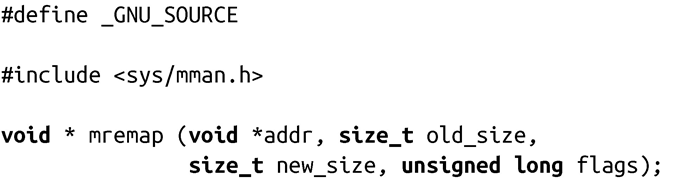

### 4.3.6　调整映射的大小

Linux提供了系统调用mremap()来扩大或减少指定映射的大小。该函数是Linux特有的：

mremap()将映射区域[addr, addr + old size)的大小增加或减少到new_size。内核可以同时移动映射区域，这取决于进程地址空间可用以及参数flags值。

> 在[addr, addr + old size)中，“[”表示该内存区域从低地址开始（包括低地址），而“）”表示区域到高地址结束（不包括高地址）。这个表示惯例称为区间（interval notation）。

参数flags的值可以是0或MREMAP_MAYMOVE ，表示内核可以根据需求移动映射区域，设置为重新指定的大小。如果内核可以移动映射区域，一个较大值的大小调整操作才更有可能会成功。

#### 返回值和错误码

成功时，mremap()返回指向新映射区域的指针。失败时，返回MAP_FAILED，并相应设置errno为以下值：

EAGAIN

内存区域被锁，不能重新调整大小。

EFAULT

指定范围内的一些页不是进程地址空间内的有效页，或者在重新映射指定页时出现错误。

EINVAL

某个参数非法。

ENOMEM

如果不进行内存区域移动，则无法扩展指定的范围（而且没有设置MREMAP_MAYMOVE），或者进程地址空间内没有足够的空闲空间。

库函数如glibc，经常使用mremap()来实现高效的realloc()，realloc()是个接口，可以通过它重新调整由malloc()分配的内存大小。举个例子：

只有当所有的malloc()操作都是唯一的匿名映射时，这段代码才有效。即便如此，它也能作为如何提高性能的简单示例。在这个这个例子中，假设libc提供了一个名为look_up_mapping_size()函数。GNU C库使用mmap()及其相关函数来进行内存分配。我们将在第8章更深入地探讨这个话题。

