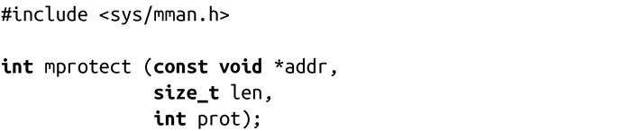

### 4.3.7　改变映射区域的权限

POSIX定义了mprotect()接口，允许程序改变已有内存区域的权限：

调用mprotect()会改变[addr, addr + len]区域内页的访问权限，其中参数addr是页对齐的。参数prot接收的值和mmap()的prot参数相同：PROT_NONE、PROT_READ、PROT_WRITE和PROT_EXEC。这些值都不能累加，如果某个内存区域可读，而且prot值设置为PROT_WRITE，调用后该区域会变成只可写。

在某些系统上，mprotect()只能操作之前由mmap()所创建的内存区域。在Linux中，mprotect()可以操作任意区域的内存。

#### 返回值和错误码

成功时，mprotect()返回0。失败时，返回-1，并把errno值相应设置为如下值之一：

EACCESS 内存不能设置参数prot所请求的权限。比如，当试图将一个以只读模式打开的文件的映射设置成可写时，会出现该错误。

EINVAL 参数addr非法或者没有页对齐。

ENOMEM 内核内存不足，无法满足请求，或者指定内存区域中有一个或多个页面不是有效的进程地址空间。

