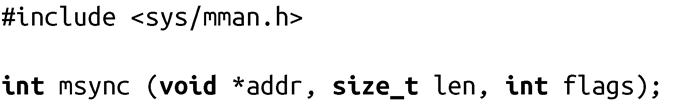

### 4.3.8　通过映射同步文件

POSIX提供了一种通过存储映射来同步文件的方式，它的功能等价于系统调用fsync()：

调用msync()可以将mmap()生成的映射在内存中的任何修改写回到磁盘中，从而实现同步内存中的映射和被映射的文件。具体来说，文件或者文件子集在内存中的映射从addr开始的len长度字节被写回到磁盘。参数addr必须是页对齐的，通常是上一次mmap()调用的返回值。

如果不调用msync()，无法保证在映射被取消之前，修改过的映射会被写回到硬盘。这一点与write()有所不同，被write()修改的缓冲区被保存在一个队列中等待被写回。而当向内存映射写数据时，进程会直接修改内核页缓存中的文件页，而无需经过内核。内核不会立即同步页缓存到硬盘。

参数flag控制同步操作的行为。它的值是以下值的按位或操作结果：

MS_SYNC

指定同步操作必须同步进行。直到所有页写回磁盘后，msync()调用才会返回。

MS_ASYNC

指定同步操作应该异步执行。更新操作是由系统调度的，而msync()调用会立即返回，不用等待write()操作完成。

MS_INVALIDATE

指定所有其他的该块映射的拷贝都将失效。后期对该文件的所有映射区域上的访问操作都将直接同步到磁盘。

MS_ASYNC和MS_SYNC必须指定其一，但二者不能共用。

msync()的用法很简单：

这个例子是以异步方式把文件的映射区域[addr, addr+len)同步到磁盘。

#### 返回值和错误码

成功时，msync()返回0。失败时，返回-1，并相应设置errno值。以下为有效的errno值：

EINVAL

参数flags同时设置了MS_SYNC和MS_ASYNC（设置成除以上三个合法参数值外的其他值），或者参数addr没有页对齐。

ENOMEM

指定的内存区域（或其中一部分）没有被映射。注意，按POSIX规定，Linux在处理请求同步一块部分被解除映射的内存时，会返回ENOMEM，但是它依然会同步该区域中所有有效的映射。

在Linux内核2.4.29版本之前，msync()会返回EFAULT，而不是ENOMEM。

