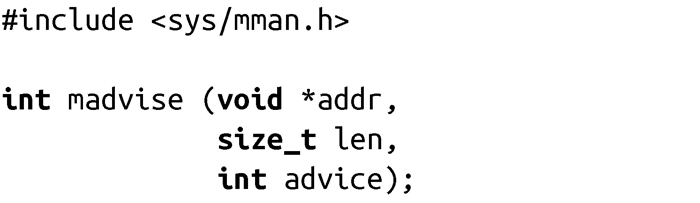
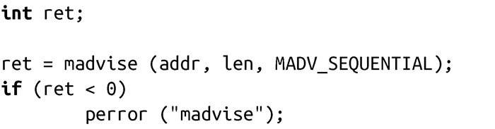

### 4.3.9　给出映射提示

Linux提供了系统调用madvise()，进程对自己期望如何访问映射区域给内核一些提示信息。内核会据此优化自己的行为，尽量更好地利用映射区域。内核通常会动态调整自己的行为，一般而言，即便没有显式提示信息，内核也能保证较好的性能，但是，适当的提示信息可以确保在某些负载情况下，可以获得期望的缓存并准确预读。

调用madvise()会告诉内核该如何对起始地址为addr，长度为len的内存映射区域进行操作。

如果len为0，内核将把该提示信息应用于所有起始地址为addr的映射。参数advice表示提示信息，可以是下列值之一：

MADV_NORMAL对指定的内存区域，应用没有特殊提示，按正常方式操作。

MADV_RANDOM应用将以随机（非顺序）访问方式，访问指定范围的页。

MADV_SEQUENTIAL应用期望从低地址到高地址顺序访问指定范围的页。

MADV_WILLNEED应用期望会很快访问指定范围的页。

MADV_DONTNEED应用在短期内不会访问指定范围内的页。

内核得到提示后，实际所采取的执行方式是和具体的实现相关：POSIX只规定了提示的含义，而没有规定具体的行为。Linux内核2.6以后的版本会以如下方式处理advice参数：

MADV_NORMAL内核行为照常，有适量的预读。

MADV_RANDOM内核不做预读，每次物理读操作只读取最小量的数据。

MADV_SEQUENTIAL内核大量预读。

MADV_WILLNEED内核开始预读，将指定的页预读至内存。

MADV_DONTNEED内核释放所有和指定页相关的资源，丢弃所有被修改的、未同步写回的页。后续对映射数据的访问会把数据重新载入内存页或以0填充请求页。

madvise()的典型用法如下：

该调用会告诉内核，进程期望连续访问内存区域（addr, addr + len）。

**预读** 
 当Linux内核访问磁盘上的文件时，通常会采用预读（readahead）来优化。也就是说，当请求加载文件的某块内容时，内核也会读取被加载块的下一个块。如果随后也请求访问下一个块（比如对于连续访问某个文件时会发生），内核可以马上返回数据。因为磁盘有缓冲区（磁盘内部也会有预读行为），而且文件通常是连续分布在磁盘的，这个优化的开销很低。 
 预读通常是有好处的，但是具体的优化效果依赖于预读的窗口大小。较大的预读窗口在连续访问文件时会很有效，而对随机访问来讲，预读则纯属无用的开销。 
 正如在第2章的“内核内幕”一节所讨论的，内核会动态地调整预读窗口，以保证在预读窗口中一定的命中率。命中率高则意味着最好把预读窗口调大，反之则表示应该把预读窗口调小。应用程序可以通过madvise()系统调用来影响预读窗口的大小。

#### 返回值和错误码

成功时，madvise()返回0。失败时，返回-1，并相应设置errno值。以下为有效的错误值：

EAGAIN

内核内部资源（可能是内存）不可用，进程可以重试。

EBADF

内存区域存在，但是没有映射到文件。

EINVAL

参数len是负数，参数addr不是页对齐的，参数advice非法，或者页面被锁定或以MADV_DONTNEED方式共享该区域。

EIO

advice参数设置为MADV_WILLNEED，操作出现内部I/O错误。

ENOMEM

指定的区域不是进程地址空间内的合法映射，或者设置了MADV_WILLNEED，但是没有足够内存可供分配。

