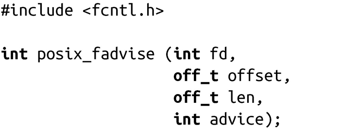
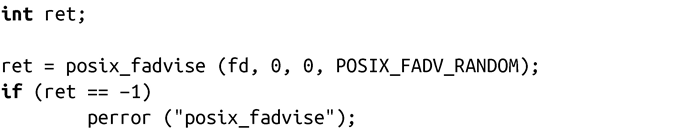

### 4.4.1　系统调用posix_fadvise()

正如它的名字一样，posix_fadvise()函数可以给出提示信息，在POSIX 1003.1-2003中定义如下：

调用posix_fadvise()会向内核提供在文件fd的[offset, offset + len) 区间内的操作提示。如果len为0，则该提示适用于区间[offset, length of file]。常见的用法是设置len和offset为0，使得提示可以应用于整个文件。

advice 的可用选项和madvise()类似。advice参数必须是以下值之一：

POSIXFADV_NORMAL 应用在指定文件的指定区域没有特殊要求，按正常情况处理。

POSIX_FADV_RANDOM应用期望在指定范围内随机访问。

POSIX_FADV_SEQUENTIAL应用期望在指定范围内从低地址到高地址顺序访问。

POSIX_FADV_WILLNEED应用期望最近会访问指定范围。

POSIX_FADV_NOREUSE应用可能在最近会访问指定范围，但只访问一次。

POSIX_FADV_DONTNEED应用最近可能不会访问指定范围。

和madvise()一样，内核对这些提示的实际处理方式因具体的实现不同而不同，甚至不同版本的Linux内核的处理方式也不尽相同。下面是当前内核的处理方式：

POSIX_FADV_NORMAL内核行为照常，有适量的预读。

POSIX_FADV_RANDOM内核禁止预读，每次物理读操作尽可能读取最少量的数据。

POSIX_FADV_SEQUENTIAL内核大量预读，读取预读窗口两倍长度的数据。

POSIX_FADV_WILLNEED内核开始预读，并将指定页读到内存中。

POSIX_FADV_NOREUSE当前，其行为与POSIX_FADV_WILLNEED一致；未来内核可能会将其作为“只使用一次”的优化，在madvise()中没有与之对应的选项。

POSIX_FADV_DONTNEED 内核丢弃所有缓存的数据。和其他选项不同，它与madvise()中对应选项行为不一样。

以下代码片段要求内核随机、无序地访问 fd所指向的文件：

#### 返回值和错误码

成功时，返回0，失败时，返回-1，并设置errno为下列值之一：

EBADF文件描述符非法。

EINVAL参数advice非法，文件描述符指向一个管道，或者设置的选项无法应用到指定的文件。

