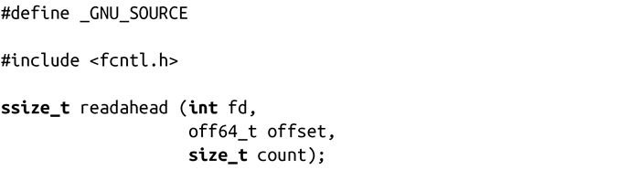

### 4.4.2　readahead()系统调用

posix_fadvise()是在Linux 内核2.6中新加入的系统调用。在此之前，readahead()可以完成和posix_fadvise()使用POSIX_FADV_WILLNEED选项时同样的功能。和posix_fadvise()不同的是，readahead()是Linux所特有的：

readahead()调用将把fd所表示文件的映射区域[offset, offset + count) 读入到页缓存中。

#### 返回值和错误码

成功时，返回0，失败时，返回-1，并设置errno为下列值之一：

EBADF指定的文件描述符非法或没有打开用于读。

EINVAL文件描述符对应的文件不支持预读。

