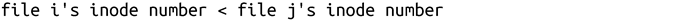
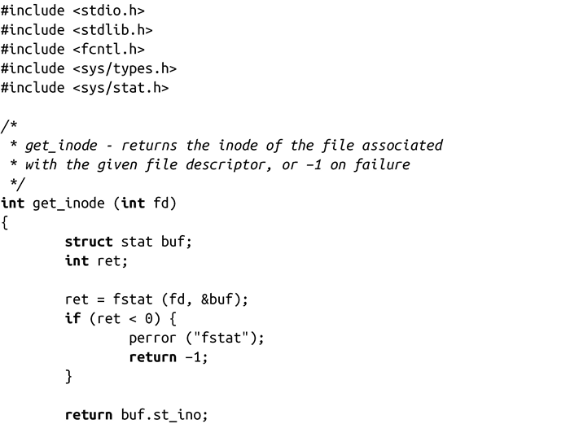
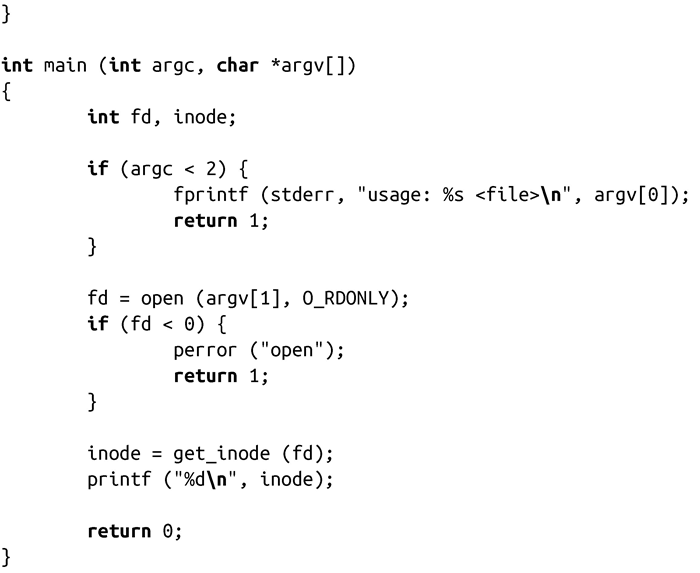
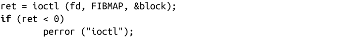
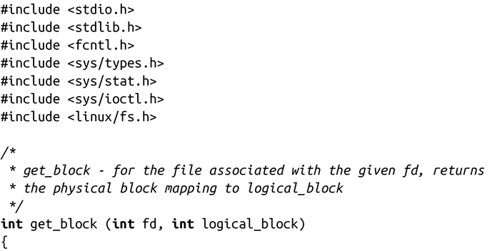
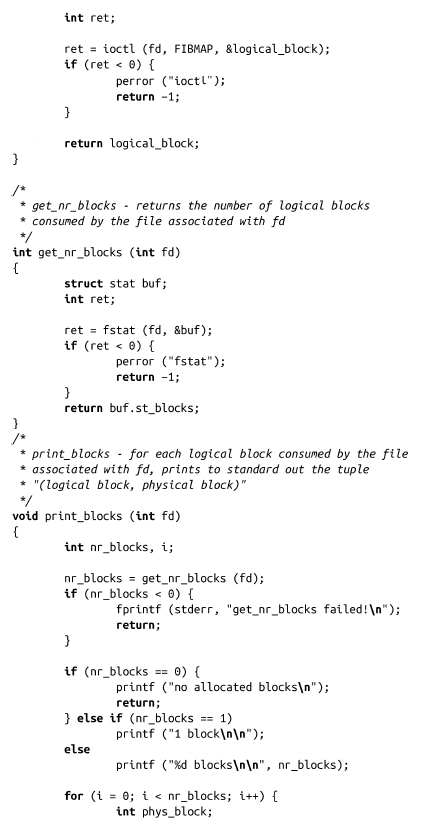
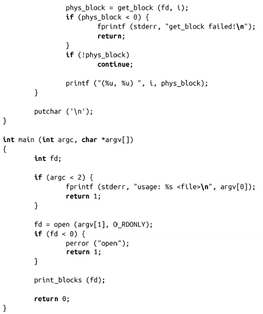

### 4.6.5　优化I/O性能

由于和系统其他组件相比，磁盘I/O很慢，而I/O系统又是现代计算机很重要的组成部分，因此使I/O性能达到最优是非常重要的。

减少I/O操作的次数（通过将很多小的操作聚集为一些大的操作），实现块对齐的I/O，或者使用用户空间缓冲（见第3章），这些是系统编程工具箱中非常重要的工具。同样，利用高级I/O技术，如向量I/O、定位I/O（见第2章）和异步I/O，这些是系统编程中需要考虑的重要模式。

不过，一些关键任务和I/O操作频繁的应用程序，可以使用额外的技巧来优化性能。如同前面讨论的，虽然Linux内核利用了高级I/O调度器来减少磁盘寻址次数，用户空间的应用可以采用类似方式，来实现更大的性能提升。

#### 用户空间I/O调度

对于需要发起大量I/O请求的I/O密集型应用，可以通过使用类似于Linux I/O调度器的方法，对挂起的I/O请求进行排序和合并，进而获得更多的性能提升。<a class="my_markdown" href="['#anchor410']">[10]</a>

既然I/O调度器会按块排序请求，减少寻址，并尽量使磁头以线性平滑的方式移动，为什么还要在应用程序中重复这些操作呢? 举个例子，假设有个应用提交大量未排序的I/O请求。这些请求以随机顺序进入I/O调度器的队列。I/O调度器在向磁盘转发请求前对其进行排序和合并，但是当请求开始向磁盘提交时，应用仍在不断提交其他I/O请求。I/O调度程序只能排序大量请求中的一小部分，其余的都被挂起。

因此，如果某个应用会生成大量请求，尤其是请求可能是遍布整个磁盘的数据，最好在提交之前对其排序，确保它们有序提交给I/O 调度器，这样会带来很大的性能提升。

但是，对于同样的信息，用户空间的程序和内核不见得有同样的访问权限。在 I/O调度器的最底层，请求已经是以物理块的形式进行组织。对物理块进行排序是很简单的。但是，在用户空间，请求是以文件和文件偏移的形式存在的。用户空间的应用必须获取信息，并对文件系统的布局做出合理的猜测。

为了使某个文件的所有I/O请求能以有利于寻址操作的顺序提交，用户空间应用可以做出很多处理。它们可按照以下方式进行排序：

+ 绝对路径
+ inode编号
+ 文件的物理块

每个选项都涉及一定程度的折衷。我们一起来简单讨论一下。

#### 按路径排序

按路径排序是最简单的，也是最低效的接近块排序的方法。在大部分文件系统所采用的布局算法中，每个目录（以及同一个父目录下的子目录）里的文件，往往在磁盘上物理相邻。同一个目录中的文件，如果在同一段时间内创建，物理相邻的概率更高。

因此，按路径排序几乎相当于文件在磁盘上的物理位置相邻。在同一个目录下的文件显然比在文件系统完全不同位置的两个文件有更大的概率会物理相邻。这种方法的缺点在于没有考虑文件系统的碎片。文件系统碎片越多，按路径排序的作用越小。即使忽略了碎片，按路径排序也只能说是接近实际的物理块顺序。其优点在于，按路径排序至少对于所有文件系统都是可用的。不管在文件布局上是否物理相邻，空间局部性使得这种方式至少比较准确。此外，这种排序方法还很容易实现。

#### 按inode排序

在UNIX中，inode（索引节点）是包含和文件唯一相关的元信息的结构。一个文件可能占用了多个物理块，但每个文件只有一个inode，其中包含了文件大小、权限、所有者等信息。我们将在第 8章更深入探讨 inode。现在，你只需要知道两点：每个文件都有一个inode与之关联，这个inode是由数字唯一标识。

使用inode排序比路径排序更有效，考虑如下关系：

通常意味着：

对UNIX系的文件系统（如ext2和ext3）而言，以上结论是毫无疑问的。对于并不使用inode的文件系统来讲，存在各种可能性，但是使用inode（无论其如何映射）排序也不失为一种比较好的方法。

可以通过stat()系统调用来获得inode序号，在第8章中将会讨论更多。由于inode和每次请求所涉及的文件关联，可以按inode序号升序方式对每个请求进行排序。

以下简单的示例程序可以输出指定文件的inode编号：

在应用中可以很容易使用get_inode()函数。

按inode编号排序有如下优点：inode编号容易获取，容易排序，和文件的物理布局很近似。主要的缺点是碎片会降低这种近似性，而且近似性只是估算，在非UNIX系统上也不够准确。无论如何，使用inode进行排序都是在用户空间I/O请求调度中最常用的方法。

#### 按物理块排序

设计自己的电梯算法，最好的方式是使用物理块进行排序。如之前讨论的，逻辑块是文件系统最小的分配单元，每个文件都被分割成若干逻辑块。逻辑块的大小和文件系统有关，每个逻辑块对应一个物理块。因此，我们可以通过确定文件的逻辑块数，确定它们对应的物理块，并在此基础上进行排序。

内核提供了通过文件的逻辑块获得物理块的方法。通过系统调用ioctl()（将在第8章讨论），使用FIBMAP命令：

这里，fd是所请求文件的文件描述符，block是希望确定其物理块号的逻辑块。调用成功时，block 会被赋值为物理块号。逻辑块号从0开始索引，与文件相关。如果文件由8个逻辑块组成，其有效值范围为0到7。

获得逻辑块到物理块的映射需要两个步骤。首先，确定给定文件中块的数量。这可以通过stat()调用来完成。其次，对每个逻辑块，发起ioctl()调用请求获得相应的物理块。

以下示例程序对通过命令行传递的文件进行相关操作，获取逻辑块号：

因为文件往往是物理连续的，所以基于每个逻辑块对I/O请求进行排序应该会比较难，按指定文件的第一个逻辑块排序则比较好一些。这样，就不需要get_nr_blocks()函数，应用可以根据以下调用的返回值进行排序：

使用FIBMAP的缺点在于它需要设置CAP_SYS_RAWIO权限——即拥有root权限。因此，非root的应用无法使用这种方法。此外，虽然FIBMAP命令是标准化的，但是其具体的实现则是和每个文件系统相关。虽然常见的文件系统如ext2和ext3都支持FIBMAP，但无法避免某些离奇的文件系统不支持的情况。如果不支持 FIBMAP，ioctl()会返回EINVAL。

不过，使用FIBMAP的优点在于它返回了文件所在的真实物理块号，这正是排序所真正需要的。即使只基于一个块地址对所有同一文件的I/O请求进行排序（内核的I/O调度器对每个I/O请求的排序就是基于块），这种方法也很接近最优排序。但是，问题在于需要root权限，这对大多数初学者而言是不可得的。

