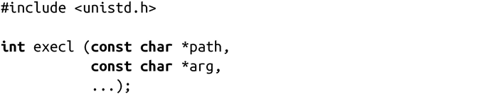
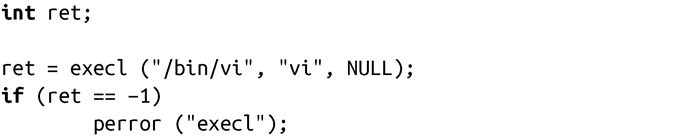
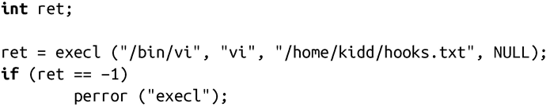
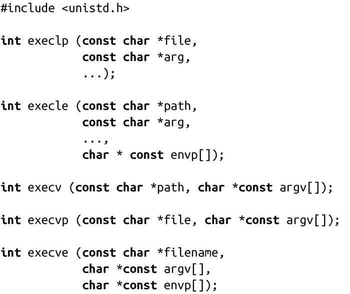
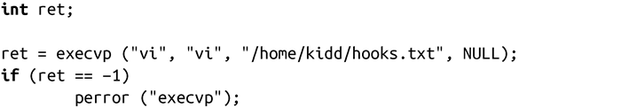
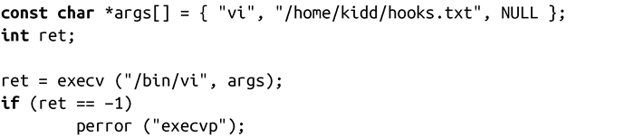

### 5.3.1　exec系统调用

不存在单一的exec函数，而是基于单个系统调用，由一系列的exec函数构成。我们先来看看其中最简单的调用execl()：

execl()调用会把path所指路径的映像载入内存，替换当前进程的映像。参数arg是它的第一个参数。省略号表示可变长度的参数列表——execl() 函数是可变参数（variadic），也就是说后续还有一个或多个其他参数，参数列表必须以NULL结尾。

举个例子，以下代码会通过/bin/vi替换当前运行的程序：

注意，这段代码遵循了UNIX惯例，用“vi”作为第一个参数。当创建/执行（fork/exec）进程时，shell会把路径中的最后部分即“vi”，放入新进程的第一个参数argv[0]，程序解析argv[0]后，就知道二进制映像文件的名字了。在很多情况下，用户会看到有些系统工具有不同的名字，实际上这些名字都是指向同一个程序的硬连接。程序通过第一个参数来确定其具体行为。

另一个例子是，如果你想要编辑文件/home/kidd/hooks.txt，可以执行如下代码：

通常情况下，execl()不会返回。调用成功时，会跳转到新的程序入口点，而刚刚运行的代码是不再存在于进程的地址空间中。错误时，execl()会返回-1，并相应设置errno值，表示错误信息。我们将在后面章节中讨论errno的可能值。

成功的execl()调用不仅改变了地址空间和进程映像，还改变了进程的其他一些属性：

+ 所有挂起的信号都会丢失。
+ 捕捉到的所有信号都会还原为默认处理方式，因为信号处理函数已经不存在于地址空间中了。
+ 丢弃所有内存锁（参看第9章）。
+ 大多数线程的属性会还原成默认值。
+ 重置大多数进程相关的统计信息。
+ 清空和进程内存地址空间相关的所有数据，包括所有映射的文件。
+ 清空所有只存在于用户空间的数据，包括C库的一些功能（如atexit()的函数行为）。

但是，进程的某些属性还是没有改变，如pid、父进程的pid、优先级、所属的用户和组。

通常，打开的文件描述符也通过exec继承下来。这意味着如果新进程知道原进程所打开的文件描述符，它就可以访问所有这些文件。但是，这通常并不是期望的行为，所以实际操作中一般会在调用exec前关闭打开的文件，当然，也可以通过fcntl( )，让内核去自动完成关闭操作。

#### exec系的其他函数

除了execl()外，exec系还有其他5个函数，分别如下：

这些函数很容易记住。l<a class="my_markdown" href="['#anchor51']">[1]</a>和v分别表示参数是以列表方式还是数组(向量)方式提供的。p表示会在用户的绝对路径path下查找可执行文件。使用变量p的命令可以只指定文件名，该文件必须在用户路径下。最后，e表示会为新进程提供新的环境变量。奇怪的是，exec函数中没有一个同时可以搜索路径和使用新环境变量的函数，虽然从技术角度看完全可以实现它。这可能是因为带p的exec函数主要是用于shell的，因为shell执行的进程通常会从shell本身继承环境变量。

和前面的例子一样，以下代码段使用execvp()来执行vi，它依赖于vi必须在用户路径下：

>  **execlp()和execvp()的安全隐患**
> 当需要设置组ID和设置用户ID操作时，进程应该以二进制程序的组或用户权限运行，而不应该以调用方的组或用户身份运行——不要调用shell或那些会调用shell的操作。否则会产生安全漏洞，调用方可能会设置环境变量来操纵shell行为。对于这类攻击，最常见的形式是“路径注入（path injection）”，黑客设置PATH变量，导致进程通过execlp()执行他选中的二进制代码，使得黑客可以以和该进程相同的权限运行任意程序。

exec系函数也可以接收数组，先构建数组，再把该数组作为参数传递。使用数组可以支持在运行时确定参数。对于可变参数列表，数据必须以NULL结束。

和前一个例子类似，以下代码段会使用execv()来执行vi：

在Linux中，exec系函数只有一个是真正的系统调用，其他都是基于该系统调用在C库中封装的函数。由于处理变长参数的系统调用难于实现，而且用户的路径只存在于用户空间中，所以execve()是唯一系统调用，其原型和用户调用完全相同。

#### 错误返回值

成功时，exec调用不会返回。失败时，返回-1，并把errno设置为下列值之一：

E2BIG　参数列表（arg）或者环境变量（envp）的长度过长。

EACCESS　没有在path所指定路径的查找权限；path所指向的文件不是一个普通文件；目标文件不可执行；path或文件所位于的文件系统以不可执行(noexec)的方式挂载。

EFAULT　给定指针非法。

EIO　 底层I/O错误（这种情况很糟糕）。

EISDIR　路径path的最后一部分或者路径解释器是个目录。

ELOOP　系统在解析path时遇到太多的符号连接。

EMFILE　调用进程打开的文件数达到进程上限。

ENFILE　打开文件达到系统上限。

ENOENT　目标路径或文件不存在，或者所需要的共享库不存在。

ENOEXEC　目标文件不是一个有效的二进制可执行文件或者是其他体系结构上的可执行格式。

ENOMEM　内核内存不足，无法执行新的程序。

ENOTDIR　path中除最后名称外的其中某个部分不是目录。

EPERM　path或文件所在的文件系统以没有sudo权限的用户（nosuid）挂载，而且用户不是root用户，path或文件的suid或sgid位被设置（只允许有sudo权限执行）。

ETXTBSY　目标目录或文件被另一个进程以可写方式打开。

