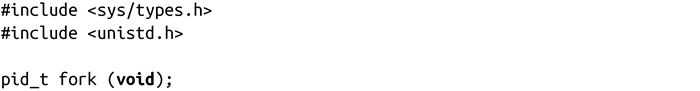
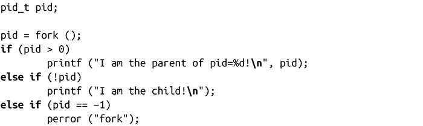
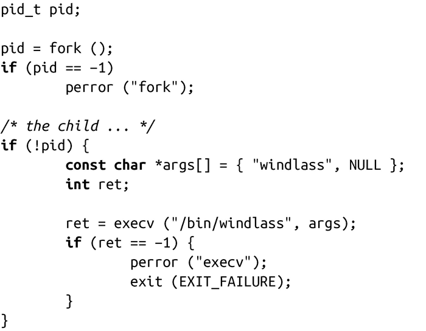
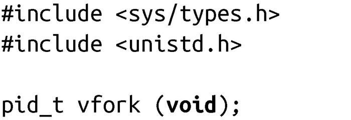

### 5.3.2　fork()系统调用

通过fork()系统调用，可以创建一个和当前进程映像一样的进程：

当fork()调用成功时，会创建一个新的进程，它几乎与调用fork()的进程完全相同。这两个进程都会继续运行，调用者进程从fork()返回后，还是照常运行。

新进程称为原进程的“子进程”，原进程称为“父进程”。在子进程中，成功的fork()调用会返回0。在父进程中，fork()会返回子进程的pid。除了一些本质性区别，父进程和子进程之间在其他各个方面都完全相同：

+ 子进程的pid是新分配的，与父进程不同。
+ 子进程的ppid会设置为父进程的pid。
+ 子进程中的资源统计信息（Resource statistics）会清零。
+ 所有挂起的信号都会清除，也不会被子进程继承（参看第10章）。
+ 所有文件锁也都不会被子进程所继承。

出错时，不会创建子进程，fork()返回-1，并相应设置errno值。errno有两种可能值，包括三种不同的含义：

EAGAIN　内核申请资源时失败，例如达到进程数上限，或者达到了RLIMIT_ NPROC设置的资源限制（rlimit）（参见第6章）。

ENOMEM　内核内存不足，无法满足所请求的操作。

fork()系统调用的用法如下：

最常见的fork()用法是创建一个新的进程，载入新的二进制映像——类似shell为用户创建一个新进程，或者一个进程创建了一个辅助进程。首先，该进程创建了新的进程，而这个新建的子进程会执行一个新的二进制可执行文件的映像。这种“派生/执行”的方式很常见，而且非常简单。下面的例子创建了一个新的进程来运行/bin/windlass：

除了创建了一个子进程外，父进程会照常继续运行。调用execv()会使子进程运行/bin/windlass。

#### 写时复制

在早期的UNIX系统中，创建进程很简单，甚至有些过于简单。调用fork()时，内核会复制所有的内部数据结构，复制进程的页表项，然后把父进程的地址空间按页（page-by-page）复制到子进程的地址空间中。糟糕的是，这种按页复制方式是十分耗时的。

现代UNIX系统采取了更优的实现方式。在现代UNIX系统如Linux中，采用了写时复制（copy-on-write，COW）的方式，而不是对父进程空间进行整体复制。

写时复制是一种基于惰性算法的优化策略，为了避免复制时的系统开销。其前提假设很简单：如果有多个进程要读取它们自己那部分资源的副本，那么复制是不必要的。每个进程只要保存一个指向这个资源的指针就可以了。只要没有一个进程修改自己的“副本”，每个进程就好像独占那个资源，从而避免了复制带来的开销。如果某个进程想要修改自己的那份资源“副本”，就会开始复制该资源，并把副本提供给这个进程。复制过程对进程而言是“透明”的。这个进程后面就可以反复修改其持有的副本，而其他进程还是共享原来那份没有修改过的资源。这就是“写时复制”这个名称的由来：只有在写入时才执行复制。

写时复制的主要好处在于：如果进程从未修改资源，则都不需要执行复制。一般来说，惰性算法的好处就在于它们会尽量延迟代价高的操作，直到必要时才执行。

在使用虚拟内存的场景下，写时复制（Copy-on-write）是以页为基础执行的。所以，只要进程没有修改其全部地址空间，就不需要复制整个地址空间。在fork()调用结束后，父进程和子进程都以为自己有唯一的地址空间，实际上它们共享父进程的原始页，这些页后面可能又会被其他的父进程或子进程共享。

写时复制在内核中的实现非常简单。这些页被标记为只读，并对内核页相关的数据结构实现写时复制。如果有进程试图修改某个页，就会产生缺页中断。内核处理缺页中断的处理方式就是对该页执行一次透明复制。这时，会清空该页的写时复制属性，表示这个页不再被共享。现代的计算机结构体系中都在内存管理单元（MMU）提供了硬件级别的写时复制支持，所以实现是很容易的。

对于调用fork()创建进程的场景，写时复制有更大的优势。由于大量的fork创建之后都会紧接着执行exec，因此把整个父进程地址空间中的内容复制到子进程的地址空间往往只是纯属浪费：如果子进程立刻执行一个新的二进制可执行文件的映像，它先前的地址空间就会被交换出去。写时复制可以对这种情况进行优化。

#### vfork()

在实现对页写时复制之前，UNIX的设计者们就一直很关注在fork后立刻执行exec所造成的地址空间的浪费。因此，BSD的开发者们在BSD 3.0系统中引入了vfork()系统调用。

vfork()调用成功时，其执行结果和fork()是一样的，除了子进程会立即执行一次exec系统调用，或者调用_exit()退出（将在下面的章节中讨论）。vfork()系统调用会通过挂起父进程，直到子进程终止或执行新的二进制镜像，从而避免地址空间和页表拷贝。在这个过程中，父进程和子进程共享相同的地址空间和页表项，并不使用写时复制。实际上，vfork()调用只完成了一件事：复制内部的内核数据结构。因此，子进程也就不能修改地址空间中的任何内存。

系统调用vfork()是个历史遗留，Linux系统本不应该实现它，虽然需要注意的是，即使提供了写时复制机制，vfork()也比fork()快，因为它没有进行页表项的复制。<a class="my_markdown" href="['#anchor52']">[2]</a>然而，写时复制的出现减弱了以vfork()替换fork()的争论。实际上，在Linux 内核2.2.0之前，vfork()只是简单的fork()封装。由于对vfork()的需求要小于fork()，所以vfork()的这种实现方式是可行的。

严格来讲，vfork()的所有实现都是有bug的：考虑一下这种情况，如果exec调用失败了，父进程将被一直挂起，直到子进程采取措施或退出。程序应该更倾向于使用简单明了的fork()调用。

