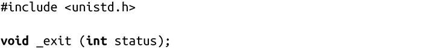
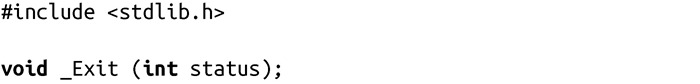

### 5.4　终止进程

POSIX和C89都定义了一个标准函数，可以终止当前进程：

对exit()的调用通常会执行一些基本的关闭步骤，然后通知内核终止这个进程。这个函数无法返回错误值——实际上它也从不返回。因此在exit()之后执行任何指令都没有意义。

参数status用于标识进程的退出状态。其他程序比如shell用户，可以检查这个值。具体来说，会返回给父进程status & 0377这个值。在本章后面，我们会具体讨论如何获取这个返回值。

EXIT_SUCCESS 和EXIT_FAILURE这两个宏分别表示成功和失败，而且是可移植的。在Linux中，0通常表示成功；非0值，如1或-1，表示失败。

因此，成功退出时，只需要简单地写上类似这样的一行代码：

在终止进程之前，C库会按顺序执行以下关闭进程的步骤。

1．调用任何由atexit() 或on_exit()注册的函数，和在系统中注册时顺序相反（我们将在本章后面讨论这些函数）。

2．清空所有已打开的标准I/O流（参见第3章）。

3．删除由tmpfile()函数创建的所有临时文件。

这些步骤完成了在用户空间需要做的所有工作，最后exit()会调用系统调用_exit( )，内核可以处理终止进程的剩余工作：

当进程退出时，内核会清理进程所创建的、不再使用的所有资源。这包括但不局限于：分配内存、打开文件和System V的信号量。清理完成后，内核会摧毁进程，并告知父进程其子进程已经终止。

应用可以直接调用_exit()，但这通常并不合适：绝大多数应用在完全退出前需要做一些清理工作，例如清空stdout流。然而，需要注意的是，vfork()用户终止进程时必须调用_exit()，而不是exit()。

