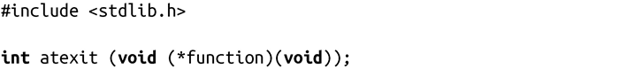
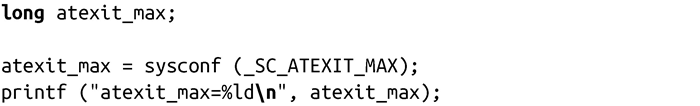
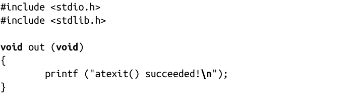
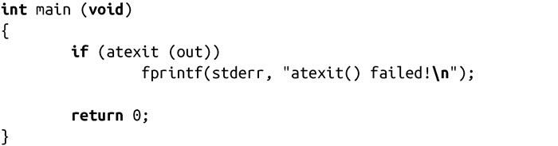

### 5.4.2　atexit()

系统调用atexit()是由POSIX 1003.1-2001所定义，Linux也实现了该函数。它是用来注册一些在进程结束时要调用的函数：

atexit()调用成功时，会注册指定的函数作为终止函数，在程序正常结束时（即进程通过调用exit()或从main()函数中返回）运行。如果进程调用了exec函数，会清空所注册的函数列表（这些函数不再存在于新进程的地址空间中）。如果进程是通过信号结束，就不会调用这些注册的函数。

指定函数必须是无参的，且没有返回值。函数形式如下：

函数调用的顺序和函数注册的顺序相反。也就是说，这些函数是存储在栈中，以后进先出的方式调用（LIFO）。注册的函数不能调用exit()，否则会导致递归调用死循环。如果需要提前结束进程，应该调用_exit()。一般不推荐这种行为，因为它会使得一些重要的关闭函数不会被调用到。

POSIX标准要求atexit()至少支持注册ATEXIT_MAX个注册函数，而且这个值至少是32。具体的最大值可以通过sysconf( )得到，参数是_SC_ATEXIT_MAX：

成功时，atexit()返回0。错误时，返回-1。

以下是个简单的例子：

