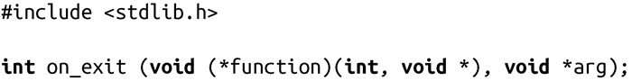

### 5.4.3　on_exit()

SunOS 4自己定义了一个和atexit()等价的函数：on_exit()。Linux的glibc也支持该函数：

该函数的工作方式和atexit()一样，只是注册的函数形式不同：

参数status是传给exit()的值或者是从main()函数返回的值。arg是传给on_exit ()的第二个参数。需要注意的是，当调用该注册函数时，要保证arg所指的内存地址必须是合法的。

最新版本的Solaris不再支持on_exit()函数了。因此，应该使用和标准兼容的atexit()。

