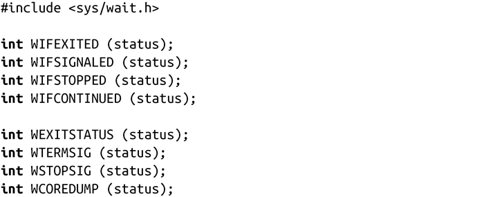
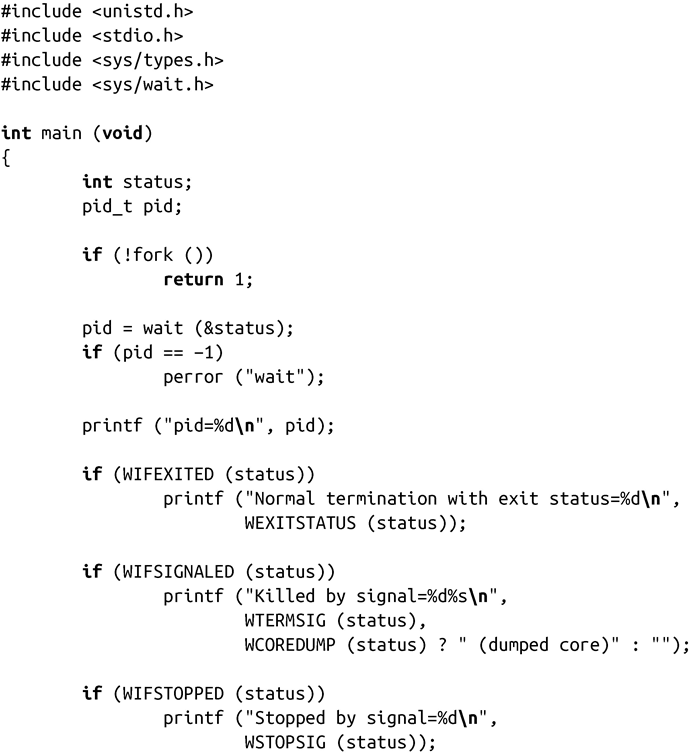

### 5.5　等待子进程终止

可以通过信号通知父进程，但是很多父进程想知道关于子进程终止的更多信息——比如子进程的返回值。

如果终止时，子进程完全消失了，父进程就无法获取关于子进程的任何信息。所以，UNIX的最初设计者们做了这样的决定：如果子进程在父进程之前结束，内核应该把该子进程设置成特殊的进程状态。处于这种状态的进程称为僵尸（zombie）进程。僵尸进程只保留最小的概要信息——一些基本内核数据结构，保存可能有用的信息。僵尸进程会等待父进程来查询自己的状态（这个过程称为在僵尸进程上等待）。只有当父进程获取到了已终止的子进程的信息，这个子进程才会正式消失，不再处于僵尸状态。

Linux内核提供了一些接口，可以获取已终止子进程的信息。其中最简单的一个是wait()，它由POSIX所定义：

调用wait()成功时，会返回已终止子进程的pid；出错时，返回-1。如果没有子进程终止，调用会阻塞，直到有一个子进程终止。如果有个子进程已经终止了，调用会立即返回。因此，当得到子进程终止信息后——比如接收到SIGCHLD信号，调用wait()函数，就会立即返回，不会被阻塞。

出错时，errno有两种可能的值：

ECHILD　调用进程没有任何子进程。

EINTR　在等待子进程结束时收到信号，调用提前返回。

如果status指针不是NULL，那它包含了关于子进程的一些其他信息。由于POSIX允许实现可以根据需要给status定义一些合适的比特位来表示附加信息，POSIX标准提供了一些宏来解释status参数：

前两个宏可能会返回真（一个非0值），这取决于子进程的结束情况。如果进程正常结束了——也就是进程调用了_exit( )，第一个宏WIFEXITED会返回真。在这种情况下WEXITSTATUS会返回status的低八位，并传递给_exit( )函数。

如果信号导致进程终止（参看第10章对信号的讨论），WIFSIGNALED会返回真。在这种情况下，WTERMSIG会返回导致进程终止的信号编号。如果进程收到信号时生成core，WCOREDUMP就返回true。虽然很多UNIX系统，包括Linux都支持WCOREDUMP，但POSIX并没有定义它。

当子进程停止或继续执行时，WIFSTOPPED和 WIFCONTINUED会分别返回真。当前，进程状态是通过系统调用ptrace()跟踪。只有当实现了调试器时，这些状态才可用，虽然和waitpid()一起使用时（参看下一节），这些调试器也可以用来实现作业控制。通常情况下，wait()仅用于获取子进程的终止信息。如果WIFSTOPPED返回真，WSTOPSIG就返回使进程终止的信号编号。虽然POSIX没有定义WIFCONTINUED，但是新的标准为waitpid()函数定义了这个宏。正如在2.6.10内核中，Linux也为wait()函数提供了这个宏。

下面，让我们来看一个示例程序，它使用wait()来确定其子进程的状态：

在这个程序中，创建了一个子进程，然后程序立即退出。随后，父进程调用了系统调用wait()来获取子进程的状态。父进程会打印出子进程的pid以及结束信息。在这个例子中，子进程是通过从main()返回来结束，因而输出结果如下所示：

如果子进程的结束不是从main()返回，而是调用abort()<a class="my_markdown" href="['#anchor53']">[3]</a>，会给自己发送一个SIGABRT信号，我们会看到如下的结果输出：

