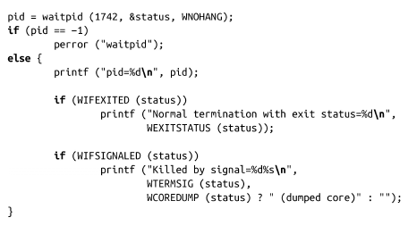

### 5.5.1　等待特定进程

监视子进程的行为是很重要的。但是，一个进程通常会有很多子进程，而且需要等待所有子进程的结束，父进程只想等待其中一个特定的子进程。一种解决方式就是多次调用wait()，每次根据返回值来判断是不是那个特定的进程。这个办法十分笨重——但是，假设这样一种情况，如果后面要检测另一个子进程的状态呢？父进程必须保存wait()的所有返回值，以备将来会用到。

如果知道需要等待的进程的pid，可以使用系统调用waitpid()：

比起wait()来，waitpid()是一个更强大的系统调用。它额外的参数可以支持细粒度调整。

参数pid指定要等待的一个或多个进程的pid。它的值必须是下面四种情况之一：

<-1　等待一个指定进程组中的任何子进程退出，该进程组的ID等于pid的绝对值。比如，传递参数值-500，表示等待在进程组500中的任何子进程。

-1　等待任何一个子进程退出，行为和wait()一致。

0　等待同一个进程组中的任何子进程。

>0　等待进程pid等于pid的子进程。比如，传递参数值500，表示等待pid为500的子进程。

参数status的作用和wait()函数的唯一参数是一样的，而且之前讨论的宏也可以使用。

参数options是0个或多个以下选项按二进制“或”运算的结果：

WNOHANG

不要阻塞，如果要等待的子进程还没有结束、停止或继续运行，会立即返回。

WUNTRACED

如果设置该位，即使调用进程没有跟踪子进程，也会设置返回调用参数中的WIFSTOPPED位。和标志位WUTRACED一样，这个标志位可以用来实现更通用的作业控制，如shell。

WCONTINUED

如果设置该位，即使是调用进程没有跟踪子进程，也会设置返回调用参数中的WIFCONTINUED位。和WUNTRACED一样，这个标志位对于shell的实现很有帮助。

调用成功时，waitpid()返回状态发生改变的那个进程的pid。如果设置了WNOHANG参数，并且要等待的一个或多个子进程的状态还没有发生改变，waitpid()返回0。出错时，调用会返回-1，并且会相应设置errno值为以下三个之一：

ECHILD　参数pid所指定的进程不存在，或者不是调用进程的子进程。

EINTR　没有设置WNOHANG，在等待时收到了一个信号。

EINVAL　参数options非法。

作为一个例子，假设程序期望获取指定pid值为1 742的子进程的返回值，如果该子进程没有结束，父进程就立即返回。这段程序代码实现如下：

此外，注意下面wait()的用法：

它和以如下方式使用waitpid()的效果是完全一样的：

