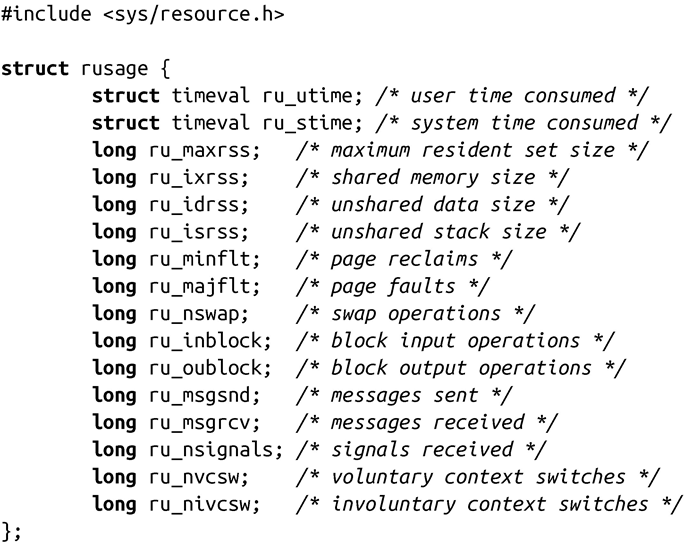

### 5.5.3　BSD中的wait3()和wait4()

waitpid()来源于AT&T的System V Release 4，而BSD也采用了自己的方法，提供了另外两个函数，用于等待子进程的状态改变：

数字3和4实际上是指这两个函数分别是有3个和4个参数的wait()函数。Berkeley在函数名称方面显然不想多费功夫。

除了rusage参数外，这两个函数的工作方式基本和waitpid()一致，以下是对wait3()的调用：

它等价于下面的waitpid()调用：

以下是对wait4()的调用：

它等价于下面的waitpid()调用：

也就是说，wait3()会等待着任意一个子进程改变状态，而wait4()会等待由pid所指定的子进程改变状态。参数options的功能和waitpid()一样。

正如前面所提到的，这些系统调用的最大区别在于rsuage参数。如果rsuage指针非空，那么会给rsuage所指向的结构体赋上与子进程相关的信息。这个结构体提供了子进程资源的使用情况：

在下一章，我们将会进一步讨论资源使用的问题。

成功时，这两个函数都返回状态发生变化的进程的pid。出错时，返回-1，errno会被设置成和waitpid()出错时一样的值。

因为wait3()和wait4()不是由POSIX所定义的，<a class="my_markdown" href="['#anchor55']">[5]</a>所以最好不要使用它们，除非真地需要了解子进程的资源使用情况。尽管这两个调用不是由POSIX所定义的，但是几乎所有的UNIX系统都支持它们。

