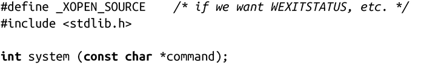
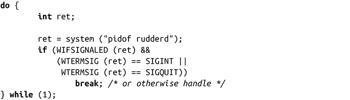
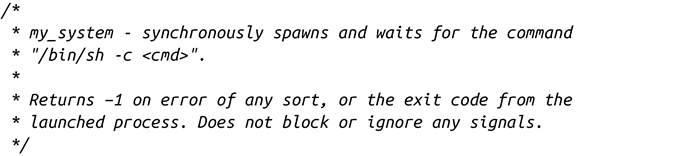
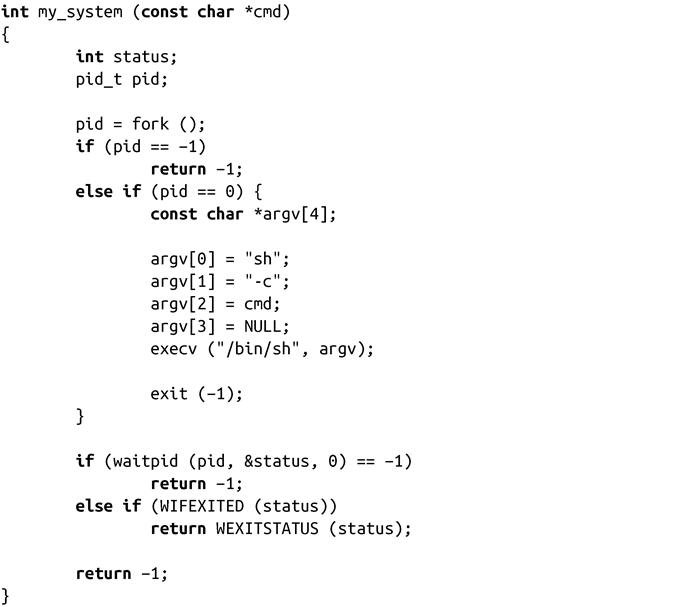

### 5.5.4　创建并等待新进程

ANSI和POSIX都定义了一个用于创建新进程并等待它结束的函数——可以把它想象成是同步创建进程。如果一个进程创建了新进程并立即开始等待它的结束，那就很适合使用下面这个接口：

system()之所以这样命名是因为进程同步创建一般被称为“交付给系统运行”。通常会使用system()来运行简单的工具或shell脚本，大多数期望能够显式获取其返回值。

调用system()会执行参数command所提供的命令，而且还可以为该命令指定参数。“/bin/sh –c”会作为前缀加到command参数前面。通过这种方式，再把整个命令传递给shell。

成功时，返回值是执行command命令得到的返回状态，该状态和执行wait()所获取的状态一致。因此，可以通过WEXITSTATUS获取执行command命令的返回值。如果调用/bin/sh本身失败了，那么从WEXITSTATUS返回的值和调用exit(127)的返回值是一样的。因为也可能是调用的命令返回了127，但没有办法来检测是shell本身发生了错误还是调用command命令执行失败而返回127。失败时，system()调用会返回-1。

如果参数command是NULL且/bin/sh是可用的，system()会返回一个非0值，否则返回0。

在执行command命令过程中，会阻塞SIGCHILD信号，而且SIGINT和SIGQUIT信号会被忽略。忽略SIGINT和SIGQUIT信号很有意义，尤其是在循环内调用system()时。如果在循环内调用system()，那需要保证程序可以正确地检测子进程的退出状态。举个例子：

利用fork()、exec系统调用和waitpid()实现一个system()是非常有用的练习。你应该自己尝试，因为它融合了本章中的许多概念。为了较完整地介绍这些概念，以下是个示例实现：

注意，这个例子没有阻塞或者禁止任何信号，这和正式的system()调用不同。根据程序情况，这可能是好事也可能是坏事。但是至少要保证SIGINT信号不被阻塞，这是很明智的，因为这样可以按照用户的意愿随时终止命令的执行。一个较好的实现可以再添加个指针参数，当指针非空时，表示不同的错误。例如，可能会加入fork_failed 和shell_failed。

>  **system()调用的安全隐患**
> system()系统调用存在与execlp()和 execvp()调用（见之前的讨论）相同的安全隐患。永远都不要从设置组ID或设置用户ID的程序中执行system()调用，因为黑客可能会修改环境变量（最常见的是PATH），获得和执行程序一样的权限。前面实现的my_system() 调用，由于使用了shell，也容易受到攻击。
> 为了避免这些攻击风险，执行设置组ID或设置用户ID的程序应该通过fork()创建进程，通过execl()执行期望的二进制代码，不要使用shell。如果也不用调用外部二进制代码，那会是更佳的解决方案！

